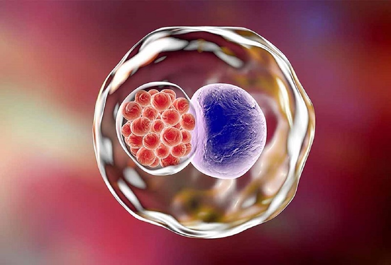
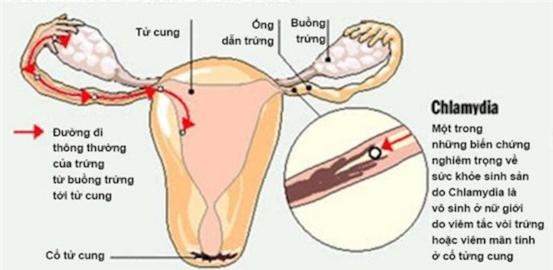

# Chlamydia

## Bệnh Chlamydia là gì?

### Như thế nào gọi là bệnh Chlamydia?

**Chlamydia** là bệnh nhiễm trùng lây truyền qua đường tình dục do vi khuẩn Chlamydia trachomatis gây nên. Bệnh thường không có triệu chứng nên nhiều người không biết mình đã mắc bệnh.&#x20;

<figure><figcaption>
<em>Chlamydia trachomatis - vi khuẩn gây ra bệnh Chlamydia</em> 
</figcaption></figure>

Người bình thường có thể **bị lây nhiễm Chlamydia** khi:

\- [Quan hệ tình dục](https://medlatec.vn/tin-tuc/the-nao-la-quan-he-tinh-duc-an-toan-va-1-so-dieu-cac-cap-doi-can-luu-y-s195-n20033) bằng đường miệng, hậu môn hay âm đạo với người bệnh.

\- Thai nhi bị lây từ mẹ khi sinh thường.

### Triệu chứng của Chlamydia là gì?

Rất ít người biết được triệu chứng của **Chlamydia là gì** bởi vì giai đoạn đầu của bệnh ít khi hoặc thậm chí không hề có triệu chứng nào cảnh báo. Khi các triệu chứng xuất hiện thì vẫn có trường hợp bị bỏ qua vì chúng thường rất nhẹ.

Những người xuất hiện triệu chứng bệnh Chlamydia thì sẽ có hiện tượng:

* &#x20;Tiểu bị đau.
* Đau bụng ở vùng hạ vị.
* Dương vật chảy dịch.
* Âm đạo chảy dịch khác thường.
* Quan hệ tình dục người phụ nữ sẽ bị đau.
* Đau tinh hoàn.

***

## Cách thức chẩn đoán và điều trị Chlamydia ra sao?

### Chẩn đoán

Biết được biện pháp **chẩn đoán Chlamydia** là gì sẽ giúp chúng ta bớt lo lắng về việc làm cách nào để phát hiện bệnh. Hiện nay việc chẩn đoán và tầm soát bệnh lý này đã được thực hiện rất đơn giản thông qua các xét nghiệm sau:

* Xét nghiệm nước tiểu tìm sự hiện diện của nhiễm trùng.
* Xét nghiệm dịch tiết&#x20;
  * Với nữ giới: dùng tâm bông lấy dịch từ cổ tử cung để kiểm tra kháng nguyên hoặc môi trường cho Chlamydia. Xét nghiệm này thường được thực hiện cùng xét nghiệm Pap định kỳ.
  * Với nam giới: dùng tăm bông chèn vào miệng niệu đạo để lấy mẫu bệnh phẩm làm xét nghiệm. Một số trường hợp cần thiết sẽ được chỉ định lấy mẫu ở hậu môn.

### Điều trị

#### **Vì sao cần điều trị Chlamydia?**

Việc tìm hiểu biện pháp điều trị Chlamydia là gì để thực hiện cũng rất cần thiết bởi khi bệnh lý này không được điều trị hoặc điều trị không đạt hiệu quả sẽ dẫn đến những nguy cơ xấu cho sức khỏe như:

<figure><figcaption>
<em>Biến chứng nguy hiểm do Chlamydia gây ra với nữ giới</em>
</figcaption></figure>

* Với nữ giới
  * Viêm vùng chậu làm tổn thương ống dẫn trứng, vô sinh.
  * Mang thai ngoài tử cung.
  * Sinh quá sớm và lây sang cho con khiến cho trẻ sơ sinh bị viêm phổi, mù lòa hoặc nhiễm trùng mắt.
* Với nam giới
  * Viêm niệu đạo không do lậu.
  * Viêm [trực tràng](https://medlatec.vn/tin-tuc/ung-thu-truc-trang-nguy-hiem-nhu-the-nao-s91-n19755).
  * Viêm mào tinh.

Ngoài ra, bệnh Chlamydia cũng có thể liên kết với nhiều vấn đề sức khỏe khác, như:

* &#x20;Nhiễm HIV: nữ giới nhiễm Chlamydia thường có nguy cơ nhiễm HIV cao hơn phụ nữ không nhiễm Chlamydia.
* Bệnh da liễu: người bị Chlamydia có nguy cơ bị các bệnh lý nhiễm trùng qua đường tình dục khác như giang mai, lậu, viêm gan. Vì thế những người bị Chlamydia thường được bác sĩ khuyên nên tiến hành thử nghiệm về bệnh lý lây nhiễm qua đường tình dục.
* Viêm vùng chậu: đây là dạng nhiễm trùng của ống dẫn trứng và tử cung, tuy có thể gây ra triệu chứng nhưng lại có nguy cơ làm hỏng ống dẫn trứng, tử cung và buồng trứng. **Viêm vùng chậu** không được điều trị có thể trở thành nguyên nhân bị áp xe bên trong buồng trứng và ống dẫn trứng.
* Bị đau xương chậu mạn tính ở phụ nữ.
* Vô sinh do nhiễm Chlamydia gây sẹo ở ống dẫn trứng.
* Viêm mào tinh hoàn khiến nam giới bị đau, sưng bìu và sốt.
* Viêm tuyến tiền liệt khiến nam giới bị đau trong hoặc sau quan hệ tình dục, ớn lạnh, sốt, đau lưng, tiểu đau.
* Viêm trực tràng khi quan hệ tình dục qua đường hậu môn, kết quả là trực tràng bị đau và thải ra chất nhầy.
* Nhiễm trùng mắt xảy ra khi bàn tay chứa khuẩn Chlamydia chạm vào mắt. Hệ quả là viêm kết mạc và thậm chí mù lòa nếu nhiễm trùng ở mắt không được điều trị.
* Nhiễm trùng sơ sinh cho trẻ khi mẹ sinh qua đường âm đạo, kết quả là trẻ bị viêm phổi, nhiễm trùng mắt và nặng nhất là mù loà.

### **Điều trị Chlamydia bằng cách nào?**

Khi đã biết được biện pháp chẩn đoán Chlamydia là gì mọi người sẽ bớt hoang mang nhưng sẽ thắc mắc liệu bệnh lý này có chữa được không. Thực ra bản thân bệnh lý này có thể được chữa khỏi hoàn toàn. Bác sĩ sẽ dùng [kháng sinh](https://medlatec.vn/tin-tuc/thuoc-khang-sinh--loi-ich-va-nguy-hai-khi-su-dung-s195-n19942) để điều trị cho những trường hợp được khẳng định mắc Chlamydia nhưng cần điều trị cả người bệnh và bạn tình để tránh tình trạng lây nhiễm chéo khi một người đã khỏi bệnh.

<figure><figcaption>
<em>Mọi trường hợp có băn khoăn biện pháp chẩn đoán Chlamydia là gì các đều được bác sĩ giải thích cặn kẽ</em> 
</figcaption></figure>

Thường thì người bệnh sẽ được điều trị bằng azithromycin hoặc  mỗi ngày 2 lần và duy trì liên tục trong 7 - 14 ngày. Khoảng một tuần sau điều trị bằng đơn thuốc được kê, tình trạng nhiễm trùng sẽ hết. Người bệnh cần kiêng quan hệ tình dục ít nhất 7 ngày hoặc cho đến khi dùng hết thuốc.&#x20;

Ngay cả khi việc dùng thuốc khiến người bệnh thấy tốt hơn nhưng chưa hết thời gian do bác sĩ chỉ định thì vẫn không nên dừng thuốc. Người bạn tình cũng sẽ được bác sĩ khuyên điều trị để tránh lây lan và tái nhiễm bệnh. Cần lưu ý rằng, sau điều trị cơ thể không có kháng thể chống lại các bệnh Chlamydia nên vẫn có nguy cơ tái nhiễm. Bệnh nhân đã điều trị và khỏi Chlamydia vẫn nên kiểm tra lại sau 3 tháng để chắc chắn được rằng tình trạng nhiễm trùng đã hoàn toàn biến mất.

Những trường hợp bị nhiễm trùng nghiêm trọng như viêm vùng chậu có thể sẽ được bác sĩ yêu cầu dùng [thuốc kháng sinh](https://medlatec.vn/tin-tuc/thuoc-khang-sinh--loi-ich-va-nguy-hai-khi-su-dung-s195-n19942) đường uống hoặc điều trị nội trú để tiêm kháng sinh tĩnh mạch. Đặc biệt, nếu nhiễm trùng vùng chậu nặng thì bên cạnh việc dùng thuốc kháng sinh có khi sẽ cần phải thực hiện phẫu thuật.

***

## TOP các dấu hiệu nhận biết sớm bệnh Chlamydia (Video)



***

## Quiz



***

## Tham khảo

1. [https://medlatec.vn/tin-tuc/chlamydia-la-gi-va-nhung-dieu-nen-biet-ve-benh-s74-n28962](https://medlatec.vn/tin-tuc/chlamydia-la-gi-va-nhung-dieu-nen-biet-ve-benh-s74-n28962)
2. [https://vi.wikipedia.org/wiki/B%E1%BB%87nh\_Chlamydia](https://vi.wikipedia.org/wiki/B%E1%BB%87nh_Chlamydia)
