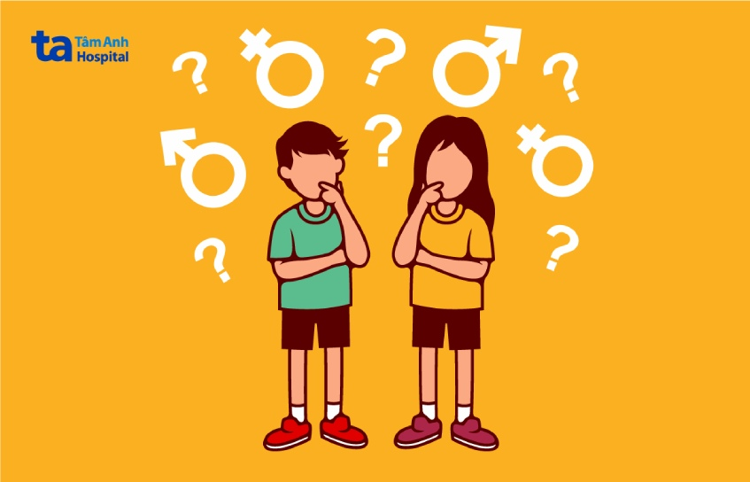

# Giới Thiệu về Giáo Dục Tình Dục

## Giáo dục giới tính là gì? 

**Giáo dục giới tính** là quá trình dạy và học với mục đích trang bị cho trẻ em và thanh thiếu niên các kiến thức, kỹ năng, thái độ và giá trị cần thiết của bản thân. Từ đó, trẻ có thể xây dựng các mối quan hệ xã hội và quan hệ tình dục dựa trên cơ sở tôn trọng lẫn nhau. Đồng thời, qua giáo dục giới tính, trẻ có thể nhận thức được mức độ ảnh hưởng của những lựa chọn mình đã đưa ra đối với bản thân và người khác, cũng như biết được cách bảo vệ quyền của bản thân trong suốt đời.

Hiện nay, cách thức giáo dục giới tính cho trẻ phổ biến nhất là thông qua bố mẹ, người chăm sóc trực tiếp. Ngoài ra, tại trường học và trong một số chiến dịch về sức khỏe cộng đồng, giáo dục giới tính cũng được thực hiện nhằm định hướng suy nghĩ và hành động của trẻ một cách đúng đắn, phù hợp lứa tuổi.&#x20;

Tuy nhiên, tại Việt Nam vẫn còn nhiều gia đình, khu vực, ngay cả người lớn và trẻ em đều cảm thấy xa lạ, ngượng ngùng khi nhắc đến vấn đề “giáo dục giới tính”. Điều này khiến nhiều trẻ hiểu sai về giới tính, tình dục; từ đó, tăng tỷ lệ trẻ bỏ học và tệ nạn, ảnh hưởng nghiêm trọng đến sự phát triển của xã hội. Chính vì vậy, giáo dục giới tính cho trẻ là vô cùng cần thiết.

<figure><figcaption>
Giáo dục giới tính giúp trẻ hiểu rõ hơn về các vấn đề sinh lý, tình dục, giới tính và xã hội.
</figcaption></figure>

***

## Nội dung bao gồm những gì? 

Giáo dục giới tính bao gồm các chủ đề dưới đây:

* Sự phát triển của con người, thay đổi của cơ thể khi dậy thì, khuynh hướng tình dục và các giới tính.
* Tôn trọng, bình đẳng giới.
* Sự khác nhau giữa các mối quan hệ: gia đình, tình bạn, tình yêu,… cách hình thành một mối quan hệ và ranh giới của các mối quan hệ đó.
* Trang bị các kỹ năng cá nhân: giao tiếp, đàm phán, đưa quyết định.
* Tình dục, định hướng suy nghĩ, cung cấp cho trẻ cái nhìn đúng đắn về tình dục.
* Trang bị các kiến thức về sức khỏe tình dục, bao gồm các bệnh tình dụng, mang thai, tránh thai hay các hậu quả của việc mang thai quá sớm.
* Ảnh hưởng của xã hội, văn hóa và tác động của các phương tiện truyền thông đối với tình dục và giới tính.

Khi bước vào tuổi dậy thì, trẻ không chỉ nhận thấy được những thay đổi bên ngoài cơ thể mà còn cảm nhận được những thay đổi từ bên trong. Điều này khiến trẻ bỡ ngỡ và bắt đầu có xu hướng tò mò, muốn khám phá nhiều hơn. Giáo dục giới tính kịp thời sẽ giúp trẻ tránh được những cái nhìn sai lệch, hiểu rõ bản thân và các vấn đề mà cơ thể đang gặp phải, cụ thể như sau

### Hiểu rõ vấn đề sinh lý của bản thân 

Cơ thể trẻ ở mỗi giới tính sẽ có những điểm khác nhau. Tương tự, sự thay đổi của cơ thể khi bước vào giai đoạn dậy thì sẽ khác nhau. Giáo dục giới tính giúp trẻ hiểu rõ về các vấn đề sinh lý, sự thay đổi của cơ thể trong từng giai đoạn từ đó hình thành tâm lý phù hợp.

### Tránh xa tệ nạn 

Giáo dục giới tính giúp trẻ biết được những bộ phận cần được bảo vệ trên cơ thể. Từ đó, trẻ biết được cách bảo vệ bản thân, giảm nguy cơ bị xâm hại tình dục.

### Giảm tỷ lệ mang thai ngoài ý muốn

Thông qua giáo dục giới tính, trẻ có thể hiểu được hậu quả của các hoạt động liên quan đến tình dục không đúng cách, nắm rõ được các thông tin về sức khỏe sinh sản và biết cách tránh thai an toàn, hiệu quả. Đây là một trong những ý nghĩa quan trọng của giáo dục giới tính cho trẻ bởi nó giúp giảm tỷ lệ mang thai ngoài ý muốn, nạo phá thai và nguy cơ mắc các bệnh truyền nhiễm qua đường tình dục.\

<figure><figcaption>
Giáo dục giới tính giúp giảm tỷ lệ mang thai ngoài ý muốn.
</figcaption></figure>

### Giúp trẻ nhận thức được giá trị của bản thân 

Từ những kiến thức nhận được từ việc giáo dục giới tính, trẻ sẽ hiểu rõ hơn về sự phát triển và thay đổi của cơ thể. Từ đó, trẻ nhận thức được giá trị của bản thân, hiểu được đâu là những mối quan hệ không lành mạnh, tình dục không an toàn.

### Biết cách phòng ngừa trước những nguy cơ xâm hại tình dục 

Một cuộc khảo sát cho thấy có đến 8% học sinh trung học bị ép buộc quan hệ tình dục, trung bình 10 học sinh sẽ có 1 học sinh bạo lực tình dục. Giáo dục giới tính giúp trẻ có cái nhìn đúng về tinh dục, hiểu về các mối quan hệ tốt và xấu cũng như cách bảo vệ bản thân trước những cám dỗ, xâm hại tình dục. \
Cách giáo dục giới tính cho trẻ em như thế nào?

***

## Cách giáo dục giới tính cho trẻ em như thế nào? 

Nhiều phụ huynh có xu hướng ép trẻ học nhiều hơn để ngày càng giỏi giang hơn nhưng lại quên mất giáo dục giới tính cho trẻ là điều vô cùng quan trọng. Thậm chí, nhiều phụ huynh còn lảng tránh, lúng túng do không có phương pháp giáo dục giới tính cho con trẻ theo từng độ tuổi. Dưới đây là một số phương pháp giáo dục giới tính cho trẻ tinh tế mà bố mẹ có thể tham khảo và thực hiện:

### Giáo dục từ sớm nhưng đừng quá vội vàng

Khi lên 4 tuổi, trẻ bước vào giai đoạn muốn được khám phá thế giới xung quanh nhiều hơn nhưng đây cũng là độ tuổi trẻ dễ bị xâm hại nhất. Lúc này, bố mẹ nên bắt đầu giải thích cho trẻ hiểu về giới tính bằng những thông tin cơ bản, nhẹ nhàng.

Ví dụ: Khi tắm hoặc thay đồ cho con, bố mẹ nên nói cho trẻ hiểu về những bộ phận “riêng tư” trên cơ thể, không ai được phép nhìn hay động chạm và

### Giải thích cho trẻ một cách đơn giản, dễ hiểu 

Trước đây, giáo dục giới tính không được phổ biến rộng rãi khiến nhiều phụ huynh cũng không thật sự hiểu rõ “giáo dục giới tính là gì?”. Đồng thời, khoảng cách thế hệ khiến nhiều phụ huynh gặp khó khăn khi trò chuyện với trẻ về các vấn đề liên quan đến giới tính. Tuy nhiên, giáo dục giới tính là cách tốt nhất giúp trẻ hiểu rõ về giới tính, sinh lý, tình dục cũng như tránh được các tệ nạn, rủi ro gây ảnh hưởng xấu đến cuộc sống sau này của trẻ. Vì vậy, bố mẹ nên vượt qua các “rào cản” để nói cho trẻ biết “giáo dục giới tính là gì?” một cách đơn giản, dễ hiểu, chậm rãi và cởi mở. Lưu ý, nếu bố mẹ tỏ ra ngại ngùng khi nói về các vấn đề này, trẻ cũng sẽ không thấy thoải mái và có thể hiểu sai cũng như sẽ tìm cách né tránh, nhất là khi gặp vấn đề.

### Sử dụng nhiều cách tiếp cận vấn đề tình dục gián tiếp&#x20;

&#x20;Trong trường hợp cảm thấy quá khó để giáo dục cho trẻ một cách thẳng thắn, bố mẹ có thể chọn các cách tiếp cận gián tiếp.

Ví dụ: Bố mẹ nên giải thích cho trẻ hiểu chỉ có sự tin tưởng mới là thứ nuôi dưỡng tình yêu chứ không phải tình dục. Trẻ cần chịu trách nhiệm với những hành động của mình. Khi trẻ đủ trưởng thành, đủ khả năng chịu trách nhiệm và thật sự tin tưởng vào đối phương thì hãy nghĩ về tình dục.

### Giáo dục theo độ tuổi 

Tùy thuộc vào từng độ tuổi, trẻ sẽ có những thay đổi về suy nghĩ, tâm lý và sinh lý. Đồng thời, khả năng tiếp cận và nhận thức của trẻ ở từng giai đoạn sẽ khác nhau. Việc giáo dục giới tính cho trẻ quá sớm hoặc quá muộn đều có thể khiến trẻ tăng nguy cơ gặp phải rủi ro. Do đó, để đảm bảo hiệu quả của giáo dục giới tính, bố mẹ nên chọn lọc thông tin và dạy cho trẻ phù hợp theo độ tuổi.

***

## Độ tuổi thích hợp để giáo dục sức khỏe giới tính? 

Giáo dục giới tính cho trẻ nên được bắt đầu khi trẻ còn nhỏ và duy trì cho đến khi trưởng thành. Điều này sẽ giúp trẻ nắm bắt thông tin một cách dễ dàng, chặt chẽ, động thời, giúp bố mẹ cảm thấy tự nhiên và dễ trò chuyện với con về vấn đề tình dục, giới tính. Tuy nhiên, khả năng tiếp nhận thông tin của trẻ ở mỗi độ tuổi sẽ khác nhau cho nên tốt nhất, bố mẹ nên chia lượng thông tin giáo dục giới tính thành nhiều giai đoạn, phù hợp với độ tuổi của trẻ

### Trẻ từ 13 – 24 tháng 

Ở giai đoạn này, trẻ cần nhận biết được tên gọi của các bộ phận trên cơ thể. Điều này sẽ giúp trẻ giao tiếp tốt hơn khi nói về các vấn đề sức khỏe, chấn thương liên quan hoặc làm dụng tình dục (nếu có).

Trẻ từ 13 – 24 tháng tuổi đã có thể nhận biết về sự khác biệt giữa nam và nữ. Tuy nhiên, bố mẹ nên giúp trẻ hiểu giới tính của một người không được xác định bởi bộ phận sinh dục của họ mà nó có thể được thể hiện qua nhiều cách khác. Cơ thể của mỗi người là riêng tư, việc trẻ tò mò và tự chạm vào các bộ phận trên cơ thể là bình thường nhưng chúng cần biết nơi nào là nơi phù hợp và nơi nào là không phù hợp cho những hành động như thế.

<figure><figcaption>
Bố mẹ có thể dạy cho trẻ các thông tin cơ bản về giáo dục giới tính khi trẻ được khoảng 2 tuổi.
</figcaption></figure>

### Trẻ mầm non, mẫu giáo (2 – 4 tuổi) 

Trẻ mầm non đã có thể hiểu cơ bản về sinh sản: tinh trùng và trứng gặp nhau sẽ tạo thành em bé, em bé lớn lên từ trong tử cung của mẹ. Nếu trẻ thấy sự quan tâm và muốn biết thêm về nó, bố mẹ có thể kể cho trẻ nghe về những câu chuyện sinh nở để trẻ biết được đây là cách duy nhất để tạo nên một gia đình. Tuy nhiên, thứ trẻ thật sự quan tâm vào thời điểm này là việc mang thai và em bé chứ không phải tình dục, do đó, bố mẹ nên chọn lọc thông tin một cách thông minh, tránh khiến trẻ bị choáng ngợp.

Điều quan trọng nhất trong giáo dục giới tính khi trẻ bước vào độ tuổi mầm non, mẫu giáo là giúp trẻ hiểu được sự riêng tư của cơ thể của mỗi người: “Không ai được phép chạm vào cơ thể, nhất là vùng riêng tư khi không có sự cho phép của mình và bản thân cũng phải được cho phép trước khi chạm vào cơ thể của người khác”. Trẻ nên biết được những người khác chỉ có thể chạm vào cơ thể của mình trong một giới hạn nhất định, không ai được yêu cầu hay tự ý chạm vào các bộ phận sinh dục của trẻ trừ bố mẹ hoặc người chăm sóc sức khỏe. Điều này sẽ giúp trẻ nhận biết được việc làm của đối phương có đang đúng đắn hay không và có thể nói cho bố mẹ về việc trẻ bị lạm dụng tình dục (nếu có).

### Trẻ tiểu học ( 5 – 8 tuổi) 

Trẻ nên hiểu được ngoài nam giới, nữ giới, còn có một số giới tính khác như dị tính, đồng tính, lưỡng tính với nhiều biểu hiện giới tính khác nhau. Đồng thời, trẻ nên biết tôn trọng giới tính và vai trò của tình dục trong một mối quan hệ.

Đối với các quy ước xã hội như quyền riêng tư, ảnh khỏa thân, cách tôn trọng người khác trong các mối quan hệ, bố mẹ nên giải thích cho trẻ hiểu một cách rõ ràng và đúng đắn. Trẻ tò mò và có thể tự tìm hiểu trên các phương tiện truyền thông như máy tính, điện thoại di động, do đó, bố mẹ nên hướng dẫn trẻ tìm hiểu một cách an toàn, tiếp nhận những thông tin phù hợp.

Lưu ý, một số trẻ có thể bắt đầu dậy thì từ khi trẻ được 10 tuổi, do đó, bố mẹ nên bắt đầu cho trẻ biết về những thông tin cơ bản về sự thay đổi của cơ thể khi dậy thì. Trẻ nên được chỉ dạy về tầm quan trọng cũng như cách tự vệ sinh, chăm sóc cơ thể ở giai đoạn này. Đồng thời, bố mẹ nên tạo những cuộc trò chuyện, kết nối với trẻ để giúp trẻ biết rằng những thay đổi này là bình thường.

### &#x20;Trẻ trước tuổi vị thành niên (9 – 12 tuổi)

Trẻ 9 – 12 tuổi đã bắt đầu cảm nhận được những thay đổi nhỏ bên trong cơ thể của mình và có khả năng tiếp nhận tốt hơn. Vì vậy, bên cạnh việc giúp trẻ hiểu rõ về tuổi dậy thì, bố mẹ nên cho trẻ biết về tình dục và những căn bệnh lây truyền qua đường tình dục cũng như cách tránh thai an toàn.

Trẻ ở tuổi trước vị thành niên nên hiểu được thế nào là một mối quan hệ tốt và một mối quan hệ xấu. Đặc biệt, trẻ trong độ tuổi này nên có kiến thức về an toàn internet, bắt nạt,… cũng như hậu quả của những hành động chia sẻ hình thỏa thân, khiêu dâm của bản thân và người khác. Trẻ nên hiểu được sự ảnh hưởng của các phương tiện truyền thông đến cách nhìn của mọi người đối với cơ thể của mình và cách truyền thông mô tả về tình dục. Điều này sẽ giúp trẻ tự đánh giá được các mô tả này là đúng hay sai, tích cực hay tiêu cực.

### Thanh thiếu niên (13 – 18 tuổi) 

Thanh thiếu niên là giai đoạn trẻ bắt đầu tò mò nhiều hơn về giới tính, tình dục, do đó, trẻ rất dễ rơi vào các cám dỗ. Đối với nữ giới, trẻ nên hiểu rằng kinh nguyệt hay ngực phát triển là những vấn đề sinh lý bình thường và không có gì phải xấu hổ. Hơn nữa, trẻ nên biết được hệ quả của việc quan hệ tình dục sớm, việc mang thai, từ đó, thực hiện các biện pháp tránh thai an toàn, quan hệ tình dục phù hợp.

***

## Giáo dục giới tính cho bé gái có giống với bé trai không? 

Thực tế, giáo dục giới tính cho bé gái và bé trai không hoàn toàn giống nhau. Nhìn chung, trẻ đều được trang bị đầy đủ các kiến thức về giới tính, sinh sản, quyền và trách nhiệm trong tình dục, cách xây dựng và lựa chọn các mối quan hệ, bình đẳng giới,… Nhưng xét về từng khía cạnh riêng biệt của giới tính, việc giáo dục giới tính sẽ có những khác biệt riêng. Ví dụ, ở tuổi dậy thì, các bé gái thường sẽ có xu hướng tự ti và e ngại về ngoại hình, dễ bị bắt nạt, trêu chọc vì những thay đổi về ngoại hình của bản thân, lúc này bố mẹ nên động viên trẻ, giúp trẻ tự tin và dám đưa ra ý kiến, bảo vệ bản thân. Đối với bé trai, trẻ sẽ có xu hướng muốn khám phá nhiều hơn, có thể sẽ bị sa vào các cạm bẫy, mối quan hệ không lành mạnh, bố mẹ nên khuyến khích trẻ quan tâm sức khỏe sinh lý của bản thân, gia đình và né xa các mối quan hệ không lành mạnh.

***

## Tham Khảo

1. [https://tamanhhospital.vn/giao-duc-gioi-tinh-cho-tre](https://tamanhhospital.vn/giao-duc-gioi-tinh-cho-tre)
2. [https://csetoolkit.unesco.org/vi/toolkit/mo-dau/dac-diem-cua-cac-chuong-trinh-gdgttdtd-hieu-qua](https://csetoolkit.unesco.org/vi/toolkit/mo-dau/dac-diem-cua-cac-chuong-trinh-gdgttdtd-hieu-qua)
3. [http://vjes.vnies.edu.vn/sites/default/files/bai\_so\_3\_-\_so\_34\_2020\_0.pdf](http://vjes.vnies.edu.vn/sites/default/files/bai_so_3_-_so_34_2020_0.pdf)
