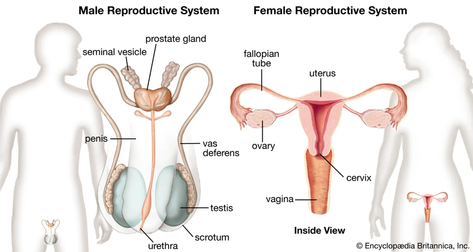

# Tìm hiểu về cấu trúc và sinh lý của hệ sinh dục nam và nữ

## Hệ sinh dục là gì?

Hệ sinh dục chứa hormone và pheromone - những chất đóng vai trò quan trọng trong quá trình sinh sản. Cấu trúc của hệ sinh dục khác biệt so với nhiều hệ cơ quan khác, phụ thuộc vào giới tính của cá thể trong loài, đặc biệt là đối với các loài đơn tính. Những khác biệt này cho phép sự kết hợp của vật chất di truyền giữa hai cá thể riêng biệt, tạo ra sự đa dạng và phù hợp về gen trong thế hệ con cháu.

<figure><figcaption>
<em>Hệ sinh dục của nam và nữ có nhiều điểm khác biệt</em>
</figcaption></figure>

Hệ sinh dục của phụ nữ có hai chức năng chính. Thứ nhất, nó sản xuất tế bào trứng. Thứ hai, nó bảo vệ và nuôi dưỡng thai nhi cho đến khi con ra đời. Trong khi đó, hệ sinh sản của nam giới chỉ có một chức năng, đó là sản xuất và lưu trữ tinh trùng. Con người có mức độ phân biệt giới cao. Ngoài sự khác biệt ở hầu hết các cơ quan sinh sản, còn có sự khác biệt ở các đặc điểm sinh dục phụ.

## Hệ sinh dục ở nam giới

Hệ sinh dục ở nam giới, còn được gọi là cơ quan sinh dục nam, có nhiệm vụ sản xuất tế bào sinh dục ([tinh trùng](https://nhathuoclongchau.com.vn/bai-viet/tinh-trung-la-gi-nhung-dieu-quan-trong-can-biet.html)) và hormone sinh sản. Các chức phận này có mối quan hệ mật thiết nhằm thực hiện chức năng sinh sản và duy trì dòng họ.

Bên ngoài, cơ quan sinh dục nam gồm dương vật, bìu và hệ lông. Tuy nhiên, cấu trúc bên trong bao gồm hai tinh hoàn, hai ống dẫn tinh, hai túi tinh, tuyến tiền liệt và niệu đạo.

### Cấu trúc bên trong cơ quan sinh dục

[Niệu đạo](https://nhathuoclongchau.com.vn/bai-viet/nieu-dao-la-gi-cac-benh-ve-nieu-dao-thuong-gap-va-cach-xu-ly.html) là ống dẫn nước tiểu từ bàng quang ra ngoài. Khi xuất tinh, van ở cổ bàng quang đóng lại, ngăn không cho nước tiểu lẫn vào tinh dịch.

Ống dẫn tinh là ống dẫn tinh trùng từ tinh hoàn lên túi tinh, sau đó đổ vào đoạn gốc của niệu đạo, đẩy tinh trùng ra ngoài qua niệu đạo.

Túi tinh có chức năng tiết ra tinh tương để cung cấp dưỡng chất cho tinh trùng. Khi hòa lẫn với tinh trùng, tinh tương tạo thành tinh dịch có màu trắng đục giống như sữa.

<figure><figcaption>
<em>Ống dẫn tinh là một trong những cơ quan sinh dục trong của nam giới</em>
</figcaption></figure>

### Cấu trúc bên ngoài cơ quan sinh dục

[Dương vật](https://nhathuoclongchau.com.vn/bai-viet/mot-so-dac-diem-ve-cau-tao-cua-duong-vat-o-nam-gioi-64757.html) là bộ phận dùng để giao hợp và xuất tinh vào âm đạo của phụ nữ. Khi nam giới kích thích tình dục, dương vật cương lên và có thể xảy ra xuất tinh. Đây là nơi có nhiều hệ thần kinh, nên khi được kích thích bằng cách xoa bóp, nó có thể mang lại nhiều khoái cảm. Đầu dương vật có một lớp da mỏng bảo vệ, được gọi là bao quy đầu.

Bìu là túi da bọc bảo vệ tinh hoàn, giữ nhiệt độ cần thiết cho quá trình sản sinh và tồn tại của tinh trùng.

[Tinh hoàn](https://nhathuoclongchau.com.vn/bai-viet/tim-hieu-ve-cau-tao-tinh-hoan-va-chuc-nang-cua-bo-phan-nay.html) là hai tuyến có hình dạng tròn nằm trong bìu. Bên trong chúng có nhiều ống xoắn lại và có hai chức năng chính:

* **Sản xuất tinh trùng:** Các ống này được gọi là ống sinh tinh vì chúng sản xuất tinh trùng. Quá trình sản xuất tinh trùng diễn ra đều đặn từ khi nam giới trưởng thành cho đến khi qua đời.
* **Sản xuất hormone nam:** Testosteron là hormone nam quan trọng, cần thiết để phát triển nam tính và trở thành đàn ông.

Tinh trùng là tế bào sinh dục nam, có hình dạng nhỏ như một nòng súng và có khả năng di chuyển. Mỗi lần xuất tinh, khoảng từ 2 đến 5 ml tinh dịch được sản xuất, chứa từ 200 triệu đến 500 triệu tinh trùng.

### Sự phát triển của tinh hoàn, dương vật và hiện tượng xuất tinh trong giai đoạn tuổi dậy thì

Trong giai đoạn tuổi dậy thì, dương vật bắt đầu phát triển và tăng kích thước từ khoảng 13 - 14 tuổi và đạt kích thước người trưởng thành sau khoảng 2 - 3 năm. Khi bị kích thích tình dục, nam giới sẽ có cảm giác khoái cảm.

***

## Hệ sinh dục của nữ giới

Cơ quan sinh dục nữ (bộ phận sinh dục nữ) là một hệ thống sinh lý phức tạp trong cơ thể phụ nữ, có nhiều chức năng đa dạng như quan hệ tình dục, tiếp nhận tinh trùng, cấy thai, [mang thai](https://nhathuoclongchau.com.vn/benh/mang-thai-486.html) và sinh con. Các bộ phận sinh dục nữ nằm ở phía dưới bụng, từ sau ruột đến đáy chậu và nằm trước lỗ hậu môn.

Cơ quan sinh dục nữ bao gồm cơ quan sinh dục ngoài và cơ quan sinh dục trong.

### Cơ quan sinh dục ngoài

Cơ quan sinh dục ngoài nữ bao gồm các bộ phận có thể nhìn thấy và sờ chạm, bao gồm:

* **Môi ngoài:** Là tổ chức bên ngoài có thể nhìn thấy, có hai lỗ hở vào bên trong gồm lỗ tiểu để thoát nước tiểu và hai tuyến Skene. Ngoài ra, còn có lỗ âm đạo là nơi máu kinh chảy ra; hai bên có tuyến Bartholin.
* **Màng trinh:** Bao quanh lỗ âm đạo, có nhiều dạng và chứa các dây thần kinh cảm giác.
* **Đầu vú:** Tương tự như dương vật ở nam giới, là khu vực nhạy cảm và khi được kích thích có thể gây khoái cảm.
* **Môi lớn và môi nhỏ:** Là những nếp gấp da bên ngoài, bảo vệ âm đạo, lỗ tiểu và lối vào âm đạo. Môi nhỏ có nhiều dây thần kinh cảm giác.
* **Âm đạo:** Là một ống hình xẹp, có nhiều nếp gấp ngang và có độ ẩm. Âm đạo là đường dẫn từ tử cung ra bên ngoài cơ thể, là nơi máu kinh và thai nhi đi qua và là nơi tiếp nhận dương vật trong quan hệ tình dục. Âm đạo kết nối với tử cung tạo thành các túi dạ con.
* **Tầng sinh môn:** Bao gồm các mô mềm (cơ, dây chằng) nâng đỡ cơ quan sinh dục trong trong khung xương chậu.

### Cơ quan sinh dục trong

Ngoài các cơ quan sinh dục ngoài có thể nhìn thấy và sờ chạm, cơ quan sinh dục nữ còn bao gồm các cơ quan bên trong như:

* **Buồng trứng:** Có hình dạng hạt dẹt, màu hơi hồng, nằm trong vùng chậu và chứa khoảng 300.000 đến 500.000 tế bào trứng (noãn) và sản xuất hormone Estrogen và Progesterone. Buồng trứng được giữ trong hố chậu bằng các dây chằng.
* **Ống dẫn trứng:** Là con đường dẫn noãn (trứng chưa thụ tinh) từ buồng trứng đến tử cung, là nơi trứng và tinh trùng kết hợp để thụ tinh xảy ra. Bên trong ống dẫn trứng có nhiều lông tơ.
* **Tử cung:** Là nơi mà trứng đã được thụ tinh di chuyển và phát triển thành phôi thai trong suốt thai kỳ. Lớp niêm mạc bên trong của tử cung gọi là niêm mạc tử cung, được chuẩn bị để chào đón phôi thai nếu thụ tinh xảy ra. [Tử cung](https://nhathuoclongchau.com.vn/bai-viet/tu-cung-nam-o-dau-va-nhung-thay-doi-cua-tu-cung-khi-mang-thai-65061.html) có khả năng co bóp để đẩy phôi thai ra ngoài trong quá trình sinh con.
* **Cổ tử cung:** Là phần hẹp nhất của tử cung và kết nối với âm đạo. Cổ tử cung chứa các tuyến nhờn, giúp bảo vệ tử cung khỏi các vi khuẩn và cung cấp chất nhờn để dễ dàng thụ tinh.
* **Mạc phôi:** Là màng bọc ngoài của phôi thai và tử cung trong suốt giai đoạn mang thai. Nó cung cấp bảo vệ và dinh dưỡng cho phôi thai.

<figure><figcaption>
<em>Các cơ quan sinh dục trong của nữ giới</em>
</figcaption></figure>

Cơ quan sinh dục nữ có vai trò quan trọng trong quá trình sinh sản và tình dục. Nó tham gia vào quá trình thụ tinh, mang thai và sinh con. Ngoài ra, nó cũng chịu ảnh hưởng của các hormone và có vai trò trong việc điều chỉnh chu kỳ kinh nguyệt và thay đổi trong quá trình lão hóa.

### Sinh lý kinh nguyệt

Kinh nguyệt là hiện tượng hàng tháng mà phụ nữ thấy ra máu từ bộ phận sinh dục trong vài ngày. Bên trong tử cung, có một lớp niêm mạc đặc biệt được gọi là niêm mạc tử cung. Theo từng tháng, niêm mạc tử cung dày dần và phát triển các mạch máu. Nếu trong giai đoạn này, trứng được thụ tinh, mầm thai sẽ gắn kết vào niêm mạc tử cung để phát triển. Trái lại, nếu không có thai, niêm mạc này sẽ bong ra và các mạch máu sẽ vỡ, dẫn đến máu kinh chảy ra qua âm đạo. Tốc độ bong niêm mạc diễn ra khác nhau tùy từng người, có người chỉ kinh trong 2 - 3 ngày, người khác khoảng 4 - 5 ngày, và một số ít phụ nữ có chu kỳ kinh kéo dài 6 - 7 ngày.

Lớp niêm mạc trong tử cung dày lên từ từ và sau đó bong ra trong quá trình kinh nguyệt để trở lại trạng thái bình thường. [Chu kỳ kinh nguyệt](https://nhathuoclongchau.com.vn/bai-viet/chu-ky-kinh-nguyet-va-nhung-dieu-can-biet.html) là sự lặp lại của quá trình này trong một khoảng thời gian nhất định. Mỗi chu kỳ kinh nguyệt có độ dài khoảng 25 - 32 ngày, trung bình là 28 ngày.

Theo dõi chu kỳ kinh nguyệt rất hữu ích để phụ nữ có thể kiểm soát tình trạng cơ thể của mình. Để tính toán chu kỳ kinh nguyệt, phụ nữ cần thực hiện các bước sau:

* Đánh dấu ngày bắt đầu kinh nguyệt đầu tiên trong tháng.
* Theo dõi liên tục ngày bắt đầu của các chu kỳ kinh nguyệt tiếp theo và tiếp tục đánh dấu.
* Khoảng thời gian giữa hai ngày đánh dấu là thời gian của chu kỳ kinh nguyệt.

### Quá trình thụ thai

Thụ thai xảy ra khi một tinh trùng và một trứng kết hợp, tạo thành một tế bào gọi là trứng đã thụ tinh. Tinh trùng được sinh ra từ tinh hoàn nam, trong khi trứng được sản xuất từ buồng trứng nữ.

Quá trình thụ tinh thường diễn ra ở một phần ba ngoài ống dẫn trứng của phụ nữ. Tại điểm gặp gỡ, tinh trùng bám vào bề mặt của trứng và sau đó xâm nhập vào bên trong để kết hợp với trứng và hình thành trứng đã thụ tinh, từ đó phát triển thành thai nhi.

Mặc dù mỗi lần [xuất tinh](https://nhathuoclongchau.com.vn/bai-viet/hien-tuong-xuat-tinh-la-gi-vi-sao-nam-gioi-nen-xuat-21-lan-1-thang.html) có hàng triệu tinh trùng, nhưng chỉ cần một tinh trùng để thụ tinh. Khi tinh trùng đã thâm nhập vào trứng, trứng sẽ tạo ra một rào cản ngăn không cho tinh trùng khác vào.

<figure><figcaption>
<em>Mỗi lần xuất tinh có hàng triệu tinh trùng nhưng chỉ cần một tinh trùng để thụ tinh</em>
</figcaption></figure>

Trứng đã thụ tinh sau đó di chuyển về tử cung và gắn vào lớp niêm mạc để phát triển. Thời gian từ khi trứng thụ tinh cho đến khi gắn vào niêm mạc là khoảng 7 ngày.

Lớp niêm mạc trong tử cung sẽ tiếp tục phát triển để cung cấp dinh dưỡng cho trứng phát triển thành thai nhi. Trong thời gian mang thai, không có kinh nguyệt và việc mất kinh được coi là một dấu hiệu của việc đã có thai.

### Phát triển của vú trong thời kỳ dậy thì

Trong giai đoạn từ 10 đến 12 tuổi, vú bắt đầu phát triển ở hai bên và nổi cao hơn ngực. Đến cuối giai đoạn dậy thì, hai vú mới phát triển đầy đủ với các tuyến sữa, túi sữa và lớp mỡ tạo nên hình dáng đầy đặn của ngực. Trong thời kỳ dậy thì, hệ thống sản sữa chưa sản xuất sữa. Khi phụ nữ mang thai, hệ thống này được phát triển hoàn thiện để sản xuất sữa cho việc nuôi con.

Hy vọng qua bài viết trên bạn đã hiểu rõ hơn cấu tạo hệ sinh dục bao gồm những bộ phận nào, chi tiết từng cơ quan trong cấu tạo bộ phận sinh dục nam và nữ,… để chủ động hơn trong cách chăm sóc sức khỏe của chính mình.&#x20;

***

## Tham khảo

1. [https://nhathuoclongchau.com.vn/bai-viet/tim-hieu-ve-cau-truc-va-sinh-ly-cua-he-sinh-duc-nam-va-nu.html](https://nhathuoclongchau.com.vn/bai-viet/tim-hieu-ve-cau-truc-va-sinh-ly-cua-he-sinh-duc-nam-va-nu.html)
