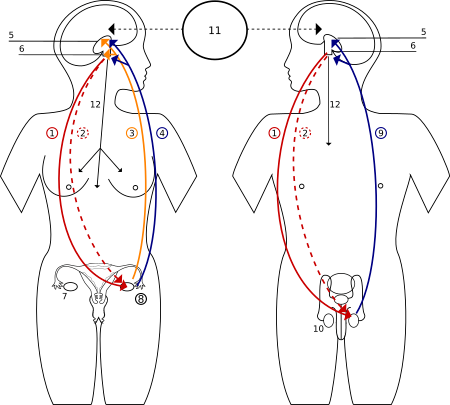

# Dậy thì (Học Thuật)

Dậy thì là quá trình thay đổi thể chất qua đó [cơ thể](https://vi.wikipedia.org/wiki/C%C6%A1_th%E1%BB%83_ng%C6%B0%E1%BB%9Di) của một [đứa trẻ](https://vi.wikipedia.org/wiki/Tr%E1%BA%BB_em) thành một cơ thể [trưởng thành](https://vi.wikipedia.org/wiki/Ng%C6%B0%E1%BB%9Di_l%E1%BB%9Bn) có khả năng [sinh sản hữu tính](https://vi.wikipedia.org/wiki/Sinh_s%E1%BA%A3n_h%E1%BB%AFu_t%C3%ADnh). Nó được bắt đầu bởi [các](https://vi.wikipedia.org/wiki/N%E1%BB%99i_ti%E1%BA%BFt_t%E1%BB%91) tín hiệu [nội tiết tố](https://vi.wikipedia.org/wiki/N%E1%BB%99i_ti%E1%BA%BFt_t%E1%BB%91) từ [não](https://vi.wikipedia.org/wiki/N%C3%A3o) đến [tuyến sinh dục](https://vi.wikipedia.org/wiki/Tuy%E1%BA%BFn_sinh_d%E1%BB%A5c): [buồng trứng](https://vi.wikipedia.org/wiki/Bu%E1%BB%93ng_tr%E1%BB%A9ng) ở con gái và [tinh hoàn](https://vi.wikipedia.org/wiki/Tinh_ho%C3%A0n) ở con trai. Để đáp ứng với các tín hiệu này, các tuyến sinh dục sản xuất hormone kích thích [ham muốn](https://vi.wikipedia.org/wiki/Ham_mu%E1%BB%91n_t%C3%ACnh_d%E1%BB%A5c) , sự tăng trưởng, chức năng , sự biến đổi của não, [xương](https://vi.wikipedia.org/wiki/X%C6%B0%C6%A1ng), [cơ](https://vi.wikipedia.org/wiki/C%C6%A1_\(sinh_h%E1%BB%8Dc\)), [máu](https://vi.wikipedia.org/wiki/M%C3%A1u), [da](https://vi.wikipedia.org/wiki/Da), [tóc](https://vi.wikipedia.org/wiki/T%C3%B3c), [vú](https://vi.wikipedia.org/wiki/V%C3%BA) và [các cơ quan sinh dục](https://vi.wikipedia.org/wiki/C%C6%A1_quan_sinh_d%E1%BB%A5c). Tăng trưởng thể chất - [chiều cao](https://vi.wikipedia.org/wiki/Chi%E1%BB%81u_cao) và khối lượng cơ thể tăng mạnh trong nửa đầu tuổi dậy thì , được hoàn thành khi cơ thể trưởng thành được phát triển hoàn toàn. Cho đến khi hoàn toàn trưởng thành về khả năng sinh sản, sự khác biệt về thể chất trước tuổi dậy thì giữa bé trai và bé gái là cơ quan sinh dục bên ngoài.

Trung bình, các bé gái bắt đầu dậy thì vào khoảng 10 - 11 tuổi và kết thúc dậy thì vào khoảng 15-17 tuổi; các bé trai bắt đầu khoảng 11-12 tuổi và kết thúc vào khoảng 16-17 tuổi.[\[1\]](https://vi.wikipedia.org/wiki/D%E1%BA%ADy_th%C3%AC#cite_note-Kail-1)[\[2\]](https://vi.wikipedia.org/wiki/D%E1%BA%ADy_th%C3%AC#cite_note-Schuiling-2)[\[3\]](https://vi.wikipedia.org/wiki/D%E1%BA%ADy_th%C3%AC#cite_note-Phillips-3) Cột mốc chính của tuổi dậy thì đối với nữ là khởi phát [kinh nguyệt](https://vi.wikipedia.org/wiki/Kinh_nguy%E1%BB%87t), xảy ra trung bình ở độ tuổi 12 đến 13.[\[2\]](https://vi.wikipedia.org/wiki/D%E1%BA%ADy_th%C3%AC#cite_note-Schuiling-2) Đối với nam giới, [xuất tinh](https://vi.wikipedia.org/wiki/Xu%E1%BA%A5t_tinh) đầu tiên xảy ra trung bình ở tuổi 13.[\[4\]](https://vi.wikipedia.org/wiki/D%E1%BA%ADy_th%C3%AC#cite_note-Jorgensen_&_Keiding-4) Trong thế kỷ 21, độ tuổi trung bình mà trẻ em, đặc biệt là trẻ em gái đến tuổi dậy thì thấp hơn so với thế kỷ 19, khi đó là 15 đối với con gái và 16 tuổi đối với con trai.[\[5\]](https://vi.wikipedia.org/wiki/D%E1%BA%ADy_th%C3%AC#cite_note-5) Điều này có thể là do bất kỳ yếu tố nào, bao gồm cải thiện dinh dưỡng dẫn đến tăng trưởng cơ thể nhanh chóng, tăng trọng lượng và lắng đọng chất béo,[\[6\]](https://vi.wikipedia.org/wiki/D%E1%BA%ADy_th%C3%AC#cite_note-Guillette_2006-6) hoặc tiếp xúc với [các chất gây rối loạn nội tiết](https://vi.wikipedia.org/wiki/Ch%E1%BA%A5t_g%C3%A2y_r%E1%BB%91i_lo%E1%BA%A1n_n%E1%BB%99i_ti%E1%BA%BFt) như [xenoestrogen](https://vi.wikipedia.org/w/index.php?title=Xenoestrogen\&action=edit\&redlink=1), đôi khi có thể là do tiêu thụ thực phẩm hoặc các yếu tố môi trường khác.[\[7\]](https://vi.wikipedia.org/wiki/D%E1%BA%ADy_th%C3%AC#cite_note-Louis_2008-7)[\[8\]](https://vi.wikipedia.org/wiki/D%E1%BA%ADy_th%C3%AC#cite_note-Mouritsen_2010-8) Tuổi dậy thì bắt đầu sớm hơn bình thường được gọi là [dậy thì sớm](https://vi.wikipedia.org/w/index.php?title=D%E1%BA%ADy_th%C3%AC_s%E1%BB%9Bm\&action=edit\&redlink=1) và dậy thì muộn hơn bình thường được gọi là [dậy thì muộn](https://vi.wikipedia.org/wiki/D%E1%BA%ADy_th%C3%AC_mu%E1%BB%99n).

Đáng chú ý trong số các thay đổi [hình thái](https://vi.wikipedia.org/wiki/H%C3%ACnh_th%C3%A1i_h%E1%BB%8Dc_\(sinh_h%E1%BB%8Dc\)) về kích thước, hình dạng, thành phần và chức năng của cơ thể tuổi dậy thì là sự phát triển của [các đặc điểm giới tính thứ cấp](https://vi.wikipedia.org/wiki/%C4%90%E1%BA%B7c_%C4%91i%E1%BB%83m_gi%E1%BB%9Bi_t%C3%ADnh_th%E1%BB%A9_c%E1%BA%A5p), "lấp đầy" cơ thể trẻ em; từ con gái thành đàn bà, từ con trai thành đàn ông. Từ _dậy thì_ từ mô tả những thay đổi về thể chất để trưởng thành tình dục, không phải là các thay đổi về tâm lý xã hội trưởng thành và văn hóa biểu hiện bằng từ _phát triển vị thành niên_ (adolescent development) trong [văn hóa phương Tây](https://vi.wikipedia.org/wiki/V%C4%83n_h%C3%B3a_ph%C6%B0%C6%A1ng_T%C3%A2y), trong đó [thanh thiếu niên](https://vi.wikipedia.org/wiki/Thanh_thi%E1%BA%BFu_ni%C3%AAn) là thời kỳ quá độ tinh thần từ thời thơ ấu đến [tuổi trưởng thành](https://vi.wikipedia.org/wiki/Ng%C6%B0%E1%BB%9Di_l%E1%BB%9Bn), mà chồng lấn nhiều với giai đoạn dậy thì của cơ thể.[\[9\]](https://vi.wikipedia.org/wiki/D%E1%BA%ADy_th%C3%AC#cite_note-9)

[Giáo dục giới tính toàn diện](https://vi.wikipedia.org/w/index.php?title=Gi%C3%A1o_d%E1%BB%A5c_gi%E1%BB%9Bi_t%C3%ADnh_to%C3%A0n_di%E1%BB%87n\&action=edit\&redlink=1) có thể góp phần giúp thanh thiếu niên hiểu rõ hơn về quá trình này.[\[10\]](https://vi.wikipedia.org/wiki/D%E1%BA%ADy_th%C3%AC#cite_note-10)

<figure><figcaption>
1.FSH - Hormone kích thích nang trứng | 2. LH - Hormone lutein hóa | 3. Hormone duy trì thai | 4. Estrogen | 5. Vùng não điều khiển (thân nhiệt, đói, khát,...) | 6. Tuyến yên | 7. Buồng trứng | 8. hCG - Hormone thai kỳ | 9. Testosterone | 10. Tinh hoàn | 11. Tác động kích thích | 12. PRL - Hormone tiết sữa
</figcaption></figure>

***

## Sự khác biệt giữa nam và nữ ở tuổi dậy thì

Hai trong số những khác biệt đáng kể nhất giữa tuổi dậy thì ở trẻ gái và tuổi dậy thì ở trẻ trai là độ tuổi bắt đầu và các [steroid sinh dục](https://vi.wikipedia.org/wiki/N%E1%BB%99i_ti%E1%BA%BFt_t%E1%BB%91_sinh_d%E1%BB%A5c) chính có liên quan, [androgen](https://vi.wikipedia.org/wiki/Androgen) và [estrogen](https://vi.wikipedia.org/wiki/Estrogen).

Mặc dù có một loạt các lứa tuổi bình thường, các bé gái thường bắt đầu dậy thì ở độ tuổi 10-11 và kết thúc dậy thì vào khoảng 15-17 tuổi; các cậu bé bắt đầu khoảng 12-14 tuổi và kết thúc vào khoảng 16-17 tuổi.[\[1\]](https://vi.wikipedia.org/wiki/D%E1%BA%ADy_th%C3%AC#cite_note-Kail-1)[\[2\]](https://vi.wikipedia.org/wiki/D%E1%BA%ADy_th%C3%AC#cite_note-Schuiling-2)[\[3\]](https://vi.wikipedia.org/wiki/D%E1%BA%ADy_th%C3%AC#cite_note-Phillips-3) Các bé gái đạt được sự trưởng thành về sinh sản khoảng bốn năm sau khi những thay đổi thể chất đầu tiên của tuổi dậy thì xuất hiện.[\[11\]](https://vi.wikipedia.org/wiki/D%E1%BA%ADy_th%C3%AC#cite_note-Maryland-11) Ngược lại, các cậu bé tăng tốc chậm hơn nhưng tiếp tục phát triển trong khoảng sáu năm sau những thay đổi về tuổi dậy thì có thể nhìn thấy lần đầu tiên.[\[12\]](https://vi.wikipedia.org/wiki/D%E1%BA%ADy_th%C3%AC#cite_note-Garn-12) Bất kỳ sự tăng [chiều cao](https://vi.wikipedia.org/wiki/Chi%E1%BB%81u_cao) nào ngoài độ tuổi sau tuổi dậy thì là không phổ biến.

Đối với con trai, [testosterone](https://vi.wikipedia.org/wiki/Testosterone) [androgen](https://vi.wikipedia.org/wiki/Androgen) là [hormone giới tính](https://vi.wikipedia.org/wiki/N%E1%BB%99i_ti%E1%BA%BFt_t%E1%BB%91_sinh_d%E1%BB%A5c) chính; Trong khi testosterone được sản xuất ra, tất cả các thay đổi của con trai được gọi là [nam tính hóa](https://vi.wikipedia.org/wiki/Nam_t%C3%ADnh_h%C3%B3a). Một sản phẩm đáng kể của chuyển hóa testosterone ở nam giới là [estradiol](https://vi.wikipedia.org/wiki/Estradiol). Việc chuyển đổi testosterone thành estradiol phụ thuộc vào lượng mỡ trong cơ thể và nồng độ estradiol ở bé trai thường thấp hơn nhiều so với bé gái. Sự "bứt phá tăng trưởng" của nam giới cũng bắt đầu sau, tăng tốc chậm hơn, và kéo dài lâu hơn trước khi epiphyses trộn vào. Mặc dù con trai trung bình thấp hơn con gái 2 xentimét (0,8 in) trước khi bắt đầu dậy thì, nam giới trưởng thành trung bình cao hơn khoảng 13 xentimét (5,1 in) so với phụ nữ. Hầu hết sự khác biệt giới tính ở [chiều cao](https://vi.wikipedia.org/wiki/Chi%E1%BB%81u_cao) trưởng thành này là do sự khởi phát muộn hơn của quá trình tăng trưởng và tiến triển chậm hơn để hoàn thành, kết quả trực tiếp của việc tăng và giảm estradiol ở nam giới muộn hơn nữ giới.[\[13\]](https://vi.wikipedia.org/wiki/D%E1%BA%ADy_th%C3%AC#cite_note-abbassi1998-13)

Hormone chi phối sự phát triển của phụ nữ là một [estrogen](https://vi.wikipedia.org/wiki/Estrogen) gọi là [estradiol](https://vi.wikipedia.org/wiki/Estradiol). Trong khi estradiol thúc đẩy tăng trưởng của [vú](https://vi.wikipedia.org/wiki/V%C3%BA) và [tử cung](https://vi.wikipedia.org/wiki/T%E1%BB%AD_cung), nó cũng là hormone chính thúc đẩy sự phát triển mạnh mẽ ở tuổi dậy thì và sự trưởng thành của đầu xương.[\[14\]](https://vi.wikipedia.org/wiki/D%E1%BA%ADy_th%C3%AC#cite_note-macgillivray1998-14) Nồng độ Estradiol tăng sớm hơn và đạt mức cao hơn ở phụ nữ so với nam giới.

Sự trưởng thành nội tiết tố của phụ nữ phức tạp hơn đáng kể so với con trai. Các [hormone steroid](https://vi.wikipedia.org/wiki/Hormone_steroid) chính, testosterone, estradiol và progesterone cũng như [prolactin](https://vi.wikipedia.org/wiki/Prolactin) đóng vai trò sinh lý quan trọng ở tuổi dậy thì. Sự hình thành tuyến sinh dục ở trẻ gái bắt đầu bằng việc sản xuất testosterone thường được chuyển đổi nhanh chóng thành estradiol bên trong buồng trứng. Tuy nhiên, tốc độ chuyển đổi từ testosterone thành estradiol (được thúc đẩy bởi cân bằng FSH/LH) trong giai đoạn dậy thì sớm mang tính cá nhân cao, dẫn đến mô hình phát triển rất đa dạng của [các đặc điểm sinh dục thứ cấp](https://vi.wikipedia.org/wiki/%C4%90%E1%BA%B7c_%C4%91i%E1%BB%83m_gi%E1%BB%9Bi_t%C3%ADnh_th%E1%BB%A9_c%E1%BA%A5p). Sản xuất progesterone trong buồng trứng bắt đầu bằng sự phát triển chu kỳ rụng trứng ở trẻ gái (trong giai đoạn lutheal của chu kỳ), trước khi [progesterone](https://vi.wikipedia.org/wiki/Progesterone) mức độ dậy thì thấp được sản xuất ở tuyến thượng thận của cả bé trai và bé gái.

## Những thay đổi trong tuổi dậy thì

### Đối với trẻ trai 

Một số thay đổi ở tuổi dậy thì có thể thấy đó là [vỡ giọng](https://vi.wikipedia.org/wiki/V%E1%BB%A1_gi%E1%BB%8Dng); giọng nói lúc này sẽ nghe to hơn rõ hơn và có độ trầm. Mọc lông mu là biểu hiện rõ nhất cùng với sự phát triển mạnh của tinh hoàn để sản xuất tinh trùng. Ngoài ra, dương vật cũng phát triển hơn. Tinh hoàn luôn duy trì ở nhiệt độ 32 độ C để đảm bảo tinh trùng được sản xuất bình thường. Mụn trứng cá bắt đầu xuất hiện nhiều vì lúc này nội tiết tố hoạt động mạnh kích tuyến trên cơ mạnh hoạt động mạnh lên là nguyên nhân gây ra mụn trứng cá. Mồ hôi đổ nhiều hơn và có mùi trên một số bộ phận của cơ thể, có thể sẽ phải dùng các sản phẩm khử mùi.

Đau ở vùng ngực do bị ảnh hưởng của nội tiết tố đi qua, nhưng không phải ai cũng găp phải tình trạng này, tình trạng chỉ gặp trên một số người.

Chiều cao của nam giới sẽ cao thêm khoảng 8–12 cm trong 1-2 năm nếu có dinh dưỡng tốt.

### Đối với trẻ nữ

Dấu hiệu đầu tiên là ngực phát triển. Ngực nhú lên thành những cục nhỏ dưới núm vú, ở một hoặc cả hai bên. Những cục này có thể cứng và có kích thước khác nhau. Thời điểm này trẻ thường bắt đầu cao nhanh.

Sau khoảng 6 tháng, lông mu xuất hiện (mặc dù ở một số trẻ, mọc lông mu lại là biểu hiện đầu tiên của dậy thì), rồi đến lông nách.

Trong vài năm tiếp theo, ngực tiếp tục lớn lên, lông mu và cơ quan sinh dục ngoài tăng trưởng dần dần, dẫn tới kỳ kinh nguyệt đầu tiên. Thay đổi này thường xuất hiện vào 12,5-13 tuổi, khoảng 2 năm sau khi bắt đầu dậy thì.

Cơ thể tiếp tục phát triển và toàn bộ quá trình dậy thì hoàn tất sau 3-4 năm, với ngực, quầng vú và lông mu phát triển như ở người lớn.

Trong giai đoạn dậy thì, các bé gái thường cao trung bình 7–8 cm/năm, và đạt đỉnh điểm khi kỳ kinh đầu tiên xuất hiện. Trẻ thường dừng cao khoảng 2 năm sau khi có kinh.

Bé gái sẽ cao thêm khoảng 25–35 cm sau khi dậy thì.

***

## Quiz



***

## Bé trai và bé gái dậy thì như thế nào (Video)



## Tham khảo

1. ^ [_a_](https://vi.wikipedia.org/wiki/D%E1%BA%ADy_th%C3%AC#cite_ref-Kail_1-0) [_b_](https://vi.wikipedia.org/wiki/D%E1%BA%ADy_th%C3%AC#cite_ref-Kail_1-1) _Kail, RV; Cavanaugh JC (2010)._ [_Human Development: A Lifespan View_](https://books.google.com/books?id=E-n5E7oyCgoC\&pg=PA296) _(ấn bản thứ 5)._ [_Cengage Learning_](https://vi.wikipedia.org/wiki/Cengage_Learning)_. tr. 296._ [_ISBN_](https://vi.wikipedia.org/wiki/ISBN) [_0-495-60037-7_](https://vi.wikipedia.org/wiki/%C4%90%E1%BA%B7c_bi%E1%BB%87t:Ngu%E1%BB%93n_s%C3%A1ch/0-495-60037-7)_._
2. ^ [_a_](https://vi.wikipedia.org/wiki/D%E1%BA%ADy_th%C3%AC#cite_ref-Schuiling_2-0) [_b_](https://vi.wikipedia.org/wiki/D%E1%BA%ADy_th%C3%AC#cite_ref-Schuiling_2-1) [_c_](https://vi.wikipedia.org/wiki/D%E1%BA%ADy_th%C3%AC#cite_ref-Schuiling_2-2) _Schuiling (2016)._ [_Women's Gynecologic Health_](https://books.google.com/books?id=QTDFDAAAQBAJ\&pg=PA22)_._ [_Jones & Bartlett Learning_](https://vi.wikipedia.org/w/index.php?title=Jones_%26_Bartlett_Learning\&action=edit\&redlink=1)_. tr. 22._ [_ISBN_](https://vi.wikipedia.org/wiki/ISBN) [_1-284-12501-7_](https://vi.wikipedia.org/wiki/%C4%90%E1%BA%B7c_bi%E1%BB%87t:Ngu%E1%BB%93n_s%C3%A1ch/1-284-12501-7)_. The changes that occur during puberty usually happen in an ordered sequence, beginning with thelarche (breast development) at around age 10 or 11, followed by adrenarche (growth of pubic hair due to androgen stimulation), peak height velocity, and finally menarche (the onset of menses), which usually occurs around age 12 or 13._
3. ^ [_a_](https://vi.wikipedia.org/wiki/D%E1%BA%ADy_th%C3%AC#cite_ref-Phillips_3-0) [_b_](https://vi.wikipedia.org/wiki/D%E1%BA%ADy_th%C3%AC#cite_ref-Phillips_3-1) _D. C. Phillips (2014)._ [_Encyclopedia of Educational Theory and Philosophy_](https://books.google.com/books?id=84StBAAAQBAJ\&pg=PA18)_._ [_Sage Publications_](https://vi.wikipedia.org/w/index.php?title=Sage_Publications\&action=edit\&redlink=1)_. tr. 18–19._ [_ISBN_](https://vi.wikipedia.org/wiki/ISBN) [_1-4833-6475-5_](https://vi.wikipedia.org/wiki/%C4%90%E1%BA%B7c_bi%E1%BB%87t:Ngu%E1%BB%93n_s%C3%A1ch/1-4833-6475-5)_. On average, the onset of puberty is about 18 months earlier for girls (usually starting around the age of 10 or 11 and lasting until they are 15 to 17) than for boys (who usually begin puberty at about the age of 11 to 12 and complete it by the age of 16 to 17, on average)._
4. [^](https://vi.wikipedia.org/wiki/D%E1%BA%ADy_th%C3%AC#cite_ref-Jorgensen_&_Keiding_4-0) (Jorgensen & Keiding 1991).
5. [^](https://vi.wikipedia.org/wiki/D%E1%BA%ADy_th%C3%AC#cite_ref-5) _Alleyne, Richard (ngày 13 tháng 6 năm 2010)._ [_“Girls now reaching puberty before 10—a year sooner than 20 years ago”_](https://web.archive.org/web/20141029170817/http://www.telegraph.co.uk/health/healthnews/7824699/Girls-now-reaching-puberty-before-10-a-year-sooner-than-20-years-ago.html)_._ [_The Daily Telegraph_](https://vi.wikipedia.org/wiki/The_Daily_Telegraph)_. London._ [_Bản gốc_](https://www.telegraph.co.uk/health/healthnews/7824699/Girls-now-reaching-puberty-before-10-a-year-sooner-than-20-years-ago.html) _lưu trữ ngày 29 tháng 10 năm 2014. Truy cập ngày 2 tháng 8 năm 2019._
6. [^](https://vi.wikipedia.org/wiki/D%E1%BA%ADy_th%C3%AC#cite_ref-Guillette_2006_6-0) _Guillette EA, Conard C, Lares F, Aguilar MG, McLachlan J, Guillette LJ; Conard; Lares; Aguilar; McLachlan; Guillette Jr (tháng 3 năm 2006)._ [_“Altered breast development in young girls from an agricultural environment”_](https://archive.org/details/sim_environmental-health-perspectives_2006-03_114_3/page/471)_. Environ. Health Perspect. 114 (3): 471–5._ [_doi_](https://vi.wikipedia.org/wiki/%C4%90%E1%BB%8Bnh_danh_%C4%91%E1%BB%91i_t%C6%B0%E1%BB%A3ng_s%E1%BB%91)_:_[_10.1289/ehp.8280_](https://doi.org/10.1289%2Fehp.8280)_._ [_PMC_](https://vi.wikipedia.org/wiki/PMC_\(%C4%91%E1%BB%8Bnh_danh\)) [_1392245_](https://www.ncbi.nlm.nih.gov/pmc/articles/PMC1392245)_._ [_PMID_](https://vi.wikipedia.org/wiki/PMID) [_16507474_](https://pubmed.ncbi.nlm.nih.gov/16507474)_._
7. [^](https://vi.wikipedia.org/wiki/D%E1%BA%ADy_th%C3%AC#cite_ref-Louis_2008_7-0) _Buck Louis GM, Gray LE, Marcus M, Ojeda SR, Pescovitz OH, Witchel SF, Sippell W, Abbott DH, Soto A, Tyl RW, Bourguignon JP, Skakkebaek NE, Swan SH, Golub MS, Wabitsch M, Toppari J, Euling SY; Gray Jr; Marcus; Ojeda; Pescovitz; Witchel; Sippell; Abbott; Soto (tháng 2 năm 2008). “Environmental factors and puberty timing: expert panel research needs”._ [_Pediatrics_](https://vi.wikipedia.org/w/index.php?title=Pediatrics_\(journal\)\&action=edit\&redlink=1)_. 121 Suppl 3: S192–207._ [_doi_](https://vi.wikipedia.org/wiki/%C4%90%E1%BB%8Bnh_danh_%C4%91%E1%BB%91i_t%C6%B0%E1%BB%A3ng_s%E1%BB%91)_:_[_10.1542/peds.1813E_](https://doi.org/10.1542%2Fpeds.1813E)_._ [_PMID_](https://vi.wikipedia.org/wiki/PMID) [_18245512_](https://pubmed.ncbi.nlm.nih.gov/18245512)_._
8. [^](https://vi.wikipedia.org/wiki/D%E1%BA%ADy_th%C3%AC#cite_ref-Mouritsen_2010_8-0) _Mouritsen A, Aksglaede L, Sørensen K, Mogensen SS, Leffers H, Main KM, Frederiksen H, Andersson AM, Skakkebaek NE, Juul A; Aksglaede; Sørensen; Mogensen; Leffers; Main; Frederiksen; Andersson; Skakkebaek (tháng 4 năm 2010). “Hypothesis: exposure to endocrine-disrupting chemicals may interfere with timing of puberty”. Int. J. Androl. 33 (2): 346–59._ [_doi_](https://vi.wikipedia.org/wiki/%C4%90%E1%BB%8Bnh_danh_%C4%91%E1%BB%91i_t%C6%B0%E1%BB%A3ng_s%E1%BB%91)_:_[_10.1111/j.1365-2605.2010.01051.x_](https://doi.org/10.1111%2Fj.1365-2605.2010.01051.x)_._ [_PMID_](https://vi.wikipedia.org/wiki/PMID) [_20487042_](https://pubmed.ncbi.nlm.nih.gov/20487042)_._
9. [^](https://vi.wikipedia.org/wiki/D%E1%BA%ADy_th%C3%AC#cite_ref-9) _The Oxford Dictionary of English Etymology_, C. T. Onions ed. Oxford University Press, 1996, p. 720.
10. [^](https://vi.wikipedia.org/wiki/D%E1%BA%ADy_th%C3%AC#cite_ref-10) [_International technical guidance on sexuality education: An evidence-informed approach_](http://unesdoc.unesco.org/images/0026/002607/260770e.pdf) _(PDF). Paris: UNESCO. 2018. tr. 67._ [_ISBN_](https://vi.wikipedia.org/wiki/ISBN) [_978-92-3-100259-5_](https://vi.wikipedia.org/wiki/%C4%90%E1%BA%B7c_bi%E1%BB%87t:Ngu%E1%BB%93n_s%C3%A1ch/978-92-3-100259-5)_._
11. [^](https://vi.wikipedia.org/wiki/D%E1%BA%ADy_th%C3%AC#cite_ref-Maryland_11-0) [_“Puberty and adolescence”_](http://umm.edu/health/medical/ency/articles/puberty-and-adolescence)_._ [_University of Maryland_](https://vi.wikipedia.org/w/index.php?title=University_of_Maryland\&action=edit\&redlink=1)_. Truy cập ngày 5 tháng 7 năm 2009._
12. [^](https://vi.wikipedia.org/wiki/D%E1%BA%ADy_th%C3%AC#cite_ref-Garn_12-0) Garn, SM. Physical growth and development. In: Friedman SB, Fisher M, Schonberg SK., editors. Comprehensive Adolescent Health Care. St Louis: Quality Medical Publishing; 1992. Truy cập 2009-02-20
13. [^](https://vi.wikipedia.org/wiki/D%E1%BA%ADy_th%C3%AC#cite_ref-abbassi1998_13-0) _Abbassi V (1998). “Growth and normal puberty”. Pediatrics. 102 (2 Pt 3): 507–513._ [_PMID_](https://vi.wikipedia.org/wiki/PMID) [_9685454_](https://pubmed.ncbi.nlm.nih.gov/9685454)_._
14. [^](https://vi.wikipedia.org/wiki/D%E1%BA%ADy_th%C3%AC#cite_ref-macgillivray1998_14-0) _MacGillivray MH, Morishima A, Conte F, Grumbach M, Smith EP; Morishima; Conte; Grumbach; Smith (1998). “Pediatric endocrinology update: an overview. The essential roles of estrogens in pubertal growth, epiphyseal fusion and bone turnover: lessons from mutations in the genes for aromatase and the estrogen receptor”. Hormone Research. 49 Suppl 1: 2–8._ [_doi_](https://vi.wikipedia.org/wiki/%C4%90%E1%BB%8Bnh_danh_%C4%91%E1%BB%91i_t%C6%B0%E1%BB%A3ng_s%E1%BB%91)_:_[_10.1159/000053061_](https://doi.org/10.1159%2F000053061)_._ [_PMID_](https://vi.wikipedia.org/wiki/PMID) [_9554463_](https://pubmed.ncbi.nlm.nih.gov/9554463)_._

