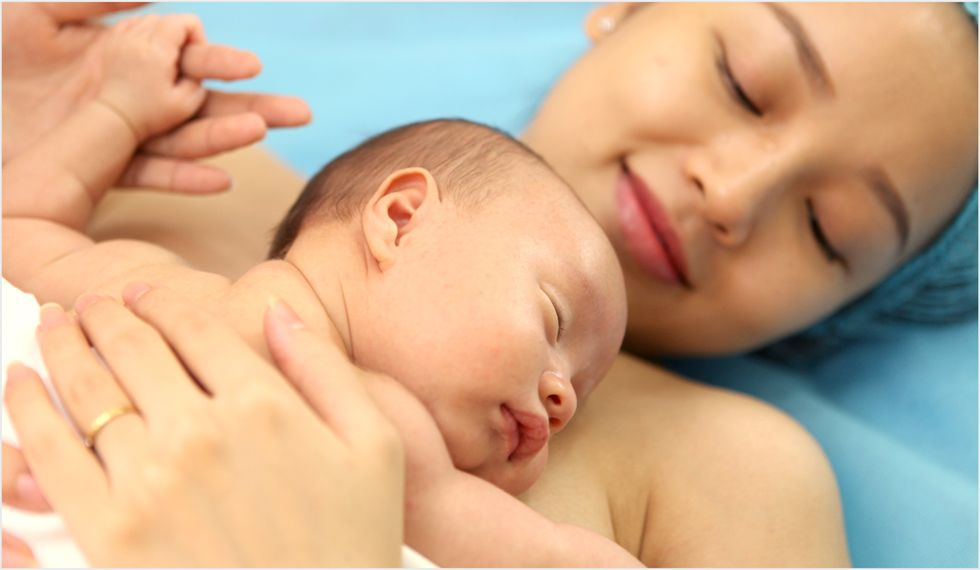

# Nữ

## Khả năng sinh sản của phụ nữ thay đổi theo độ tuổi 

Ở độ tuổi 20 – 24, phụ nữ dễ thụ thai nhất. Sau đó, khả năng thụ thai giảm dần, ở mốc 35 tuổi trở đi bắt đầu giảm mạnh. Đến khi bước sang tuổi 45, rất ít phụ nữ có thể thụ thai một cách tự nhiên.

<figure><figcaption>
Đa số phụ nữ lớn tuổi sinh con gặp khó khăn trong việc thụ thai
</figcaption></figure>

Điều này được lý giải rằng: một bé gái sinh ra có khoảng 2 triệu nang noãn (trứng chưa trưởng thành) trong cơ thể. Số lượng nang noãn này “rơi rụng” theo quá trình bé gái lớn lên và sụt giảm nhanh chóng kể từ lúc dậy thì (do mỗi chu kỳ kinh nguyệt, hàng trăm nang noãn được “huy động” để chuẩn bị cho sự rụng trứng, nhưng chỉ có 1 hay vài trứng chín và rụng, số còn lại bước vào quá trình tự tiêu hủy dưới sự tác động của hormone sinh dục nữ). Như vậy, theo thời gian, số lượng nang noãn giảm dần và sẽ hết khi mãn kinh. Điều này không giống như ở người đàn ông – tinh trùng được sinh ra liên tục.

Bên cạnh khả năng thụ thai, phụ nữ càng lớn tuổi sinh con càng đối diện nguy cơ cao gặp biến chứng trong thai kỳ như tiểu đường, cao huyết áp…; nguy cơ sảy thai. Đặc biệt, nguy cơ con chậm phát triển về thần kinh vận động cũng tăng theo tuổi của mẹ, do mẹ càng lớn tuổi thì khả năng các nhiễm sắc thể ở trứng dính vào nhau càng cao, dẫn đến các bệnh liên quan đến rối loạn nhiễm sắc thể cho thai nhi như hội chứng Down, Edwards…

Theo một nghiên cứu, mẹ 25 tuổi có tỷ lệ sinh con bị bệnh Down chỉ là 1/1250; 30 tuổi là 1/952, trên 35 tuổi là 1/378, trên 45 tuổi là 1/30.

Xét về khả năng thụ thai thì 20 – 24 là độ tuổi tốt nhất, nhưng ở khía cạnh chăm sóc con cái sau sinh thì phụ nữ 25 – 34 tuổi thuận lợi hơn do khả năng ổn định hơn về tâm lý, tài chính… Nhìn chung, ở độ tuổi 20 – 34, phụ nữ đều được bác sĩ tư vấn nên sinh con.

<figure><figcaption>
Độ tuổi mang thai tốt nhất của phụ nữ là 20 – 34 tuổi
</figcaption></figure>

Với phụ nữ dưới 20 tuổi, ngoài vấn đề khung xương chậu hẹp thì yếu tố tâm lý, tài chính chưa sẵn sàng cũng là nguyên nhân khiến quá trình mang thai và sinh nở gặp khó khăn.

***

## Phụ nữ dù ở độ tuổi nào cũng còn hy vọng… 

Tuổi tác ảnh hưởng lớn đến khả năng làm mẹ, điều này có nghĩa là phụ nữ có những độ tuổi sinh sản thuận lợi và ít thuận lợi hơn. Tuy nhiên việc có được đứa con khỏe mạnh còn phụ thuộc vào yếu tố di truyền, môi trường, lối sống… của mẹ.

Vì vậy, phụ nữ ở tuổi nào cũng nên chăm sóc sức khỏe bản thân, hình thành thói quen sống khoa học. Khi có ý định mang thai nên bổ sung axit folic. Khi có thai nên đi khám sớm, khám thai định kỳ đầy đủ.

Đặc biệt, với sự tiến bộ của y học ngày nay, phụ nữ hiếm muộn thêm hy vọng được thực hiện thiên chức làm mẹ. Rất nhiều trường hợp chị em lớn tuổi, thậm chí đã mãn kinh, hoặc gặp vấn đề về tử cung, buồng trứng, bị bệnh mãn tính… vẫn thỏa mong ước chào đón con yêu ra đời nhờ các phương pháp hỗ trợ sinh sản.

***

## Tham Khảo

1. [https://tamanhhospital.vn/tuoi-sinh-con-tot-nhat-cua-phu-nu/](https://tamanhhospital.vn/tuoi-sinh-con-tot-nhat-cua-phu-nu/)
2. [https://www.vinmec.com/vie/bai-viet/tuoi-sinh-de-ly-tuong-la-bao-nhieu-vi](https://www.vinmec.com/vie/bai-viet/tuoi-sinh-de-ly-tuong-la-bao-nhieu-vi)

