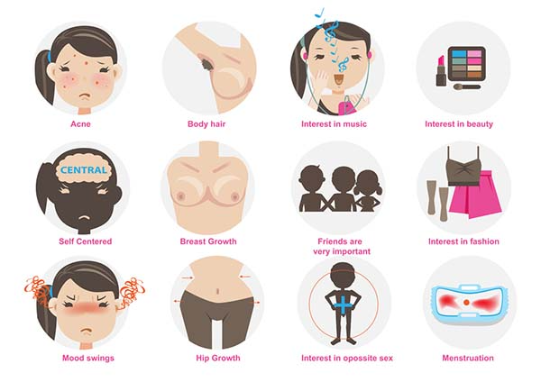
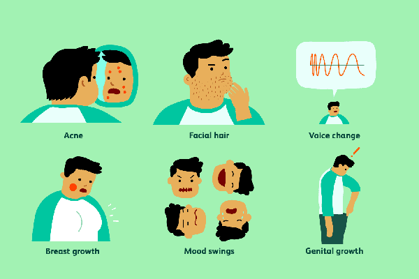

# Phát triển trong tuổi dậy thì

## Dậy thì là gì?

Dậy thì là quá trình cơ thể trải qua các thay đổi sinh lý dẫn đến khả năng sinh sản. Đây là giai đoạn mà các tuyến nội tiết, đặc biệt là tuyến yên và tuyến sinh dục, hoạt động mạnh mẽ hơn, sản sinh ra các hormone giới tính như testosterone ở nam và estrogen ở nữ. Những hormone này chịu trách nhiệm chính cho các thay đổi về thể chất và tâm lý trong giai đoạn dậy thì.

***

## Các giai đoạn phát triển dậy thì ở nam và nữ

Dậy thì ở nam và nữ có một số điểm tương đồng nhưng cũng có những khác biệt rõ rệt. Thông thường, [dậy thì](https://www.pharmacity.vn/benh/day-thi-som.html) ở nữ bắt đầu sớm hơn ở nam, thường là từ 8-13 tuổi, trong khi ở nam là từ 9-14 tuổi. Các giai đoạn phát triển dậy thì có thể được chia thành các [giai đoạn](https://www.pharmacity.vn/cac-giai-doan-tuoi-day-thi-su-thay-doi-cua-be-trai-va-be-gai-khi-day-thi.htm) sau:

### Giai đoạn dậy thì [ở nữ](https://www.pharmacity.vn/tuoi-day-thi-cua-con-gai.htm)

* Giai đoạn 1 (Trước dậy thì):
  * Không có thay đổi rõ ràng nào về thể chất.
  * Các tuyến nội tiết bắt đầu hoạt động nhưng chưa có dấu hiệu bề ngoài.
* Giai đoạn 2 (Bắt đầu dậy thì):
  * Ngực bắt đầu phát triển, thường là dấu hiệu đầu tiên của dậy thì.
  * Lông mu bắt đầu xuất hiện.
  * Thay đổi về chiều cao và cân nặng, cơ thể trở nên mềm mại hơn.
* Giai đoạn 3 (Dậy thì phát triển):
  * Ngực tiếp tục phát triển, nhũ hoa bắt đầu nâng lên.
  * Lông mu dày đặc hơn.
  * Kinh nguyệt bắt đầu xuất hiện ở nhiều bé gái.
* Giai đoạn 4 (Tiến triển):
  * Ngực gần như đạt kích thước trưởng thành.
  * Lông mu lan rộng đến đùi trong.
  * Thay đổi về mùi cơ thể và dầu da có thể xuất hiện.
* Giai đoạn 5 (Trưởng thành):
  * Ngực và lông mu đạt đến mức trưởng thành.
  * Chiều cao có thể vẫn tiếp tục tăng nhưng chậm lại.

<figure><figcaption>
Các dấu hiệu dậy thì ở trẻ nữ
</figcaption></figure>

### Giai đoạn dậy thì [ở nam](https://www.pharmacity.vn/dau-hieu-day-thi-o-nam.htm)

* Giai đoạn 1 (Trước dậy thì):
  * Không có thay đổi rõ ràng về thể chất.
  * Các tuyến nội tiết bắt đầu hoạt động nhưng chưa có dấu hiệu bề ngoài.
* Giai đoạn 2 (Bắt đầu dậy thì):
  * Tinh hoàn và bìu bắt đầu phát triển.
  * Lông mu bắt đầu xuất hiện.
  * Thay đổi về chiều cao và tăng cơ bắp.
* Giai đoạn 3 (Dậy thì phát triển):
  * [Dương vật](https://www.pharmacity.vn/nhung-dieu-can-biet-ve-duong-vat-tuoi-day-thi.htm) và tinh hoàn tiếp tục phát triển.
  * Lông mu dày đặc hơn, lan ra bìu và dương vật.
  * Giọng nói bắt đầu trầm hơn.
  * Lông dưới cánh tay và lông mặt bắt đầu xuất hiện.
* Giai đoạn 4 (Tiến triển):
  * Dương vật và tinh hoàn đạt kích thước trưởng thành.
  * Lông mu tiếp tục lan rộng.
  * Giọng nói trầm và ổn định.
  * Tăng trưởng chiều cao tiếp tục mạnh mẽ.
*   Giai đoạn 5 (Trưởng thành):

    * Các đặc điểm giới tính thứ cấp như lông mặt, lông ngực tiếp tục phát triển.
    * Chiều cao dần ổn định.

<figure><figcaption>
Các dấu hiệu dậy thì ở bé trai
</figcaption></figure>

***

## Thay đổi về thể chất và tinh thần trong từng giai đoạn

### Thay đổi về thể chất

* Nữ: Thay đổi về ngực, lông mu, chiều cao, kinh nguyệt, và mùi cơ thể.
* Nam: Thay đổi về dương vật, tinh hoàn, lông mu, giọng nói, và cơ bắp.

### Thay đổi về tinh thần

* Cảm xúc: Dễ thay đổi, cảm xúc mạnh mẽ hơn, có thể có lo âu, căng thẳng.
* Nhận thức: Tăng cường ý thức về bản thân, bắt đầu quan tâm đến hình ảnh cá nhân và mối quan hệ xã hội.
* Hành vi: Tìm kiếm sự độc lập, thích thử nghiệm và có thể có những hành vi nổi loạn.

## Lời khuyên cho phụ huynh và trẻ em trong mỗi giai đoạn

### Đối với phụ huynh

* Hiểu biết: Nắm rõ các giai đoạn và dấu hiệu của dậy thì để có thể nhận biết và hỗ trợ trẻ kịp thời.
* Giao tiếp: Mở cửa cho những cuộc trò chuyện chân thành về các thay đổi cơ thể và cảm xúc. Hãy là người lắng nghe và đồng cảm.
* Giáo dục: Cung cấp cho trẻ những thông tin chính xác và phù hợp về sự phát triển cơ thể và tâm lý.
* Hỗ trợ: Động viên và hỗ trợ trẻ trong việc xây dựng lòng tự trọng và sự tự tin.

### Đối với trẻ em

* Chấp nhận thay đổi: Hiểu rằng những thay đổi cơ thể là bình thường và là một phần của sự trưởng thành.
* Giao tiếp: Không ngần ngại hỏi cha mẹ hoặc người lớn đáng tin cậy khi có bất kỳ thắc mắc hoặc lo lắng nào.
* Giữ gìn sức khỏe: Thực hiện các thói quen lành mạnh như ăn uống đủ chất, tập thể dục đều đặn và duy trì vệ sinh cá nhân.
* Quản lý cảm xúc: Học cách quản lý cảm xúc và giải tỏa căng thẳng thông qua các hoạt động tích cực.

***

## Kết luận

Dậy thì là một quá trình phức tạp và đa dạng, đòi hỏi sự hiểu biết và hỗ trợ từ cả phụ huynh và trẻ em. Bằng cách nhận biết và hiểu rõ các giai đoạn phát triển, thay đổi về thể chất và tinh thần, chúng ta có thể giúp trẻ em trải qua giai đoạn này một cách suôn sẻ và tự tin hơn. Hãy nhớ rằng, dậy thì không chỉ là về sự phát triển cơ thể mà còn là sự phát triển toàn diện của cá nhân, bao gồm cả cảm xúc và tâm lý.

***

## Tham khảo

1. [https://www.pharmacity.vn/giai-doan-phat-trien-day-thi.htm](https://www.pharmacity.vn/giai-doan-phat-trien-day-thi.htm)
2. [https://nhathuoclongchau.com.vn/benh/day-thi-102.html](https://nhathuoclongchau.com.vn/benh/day-thi-102.html)
