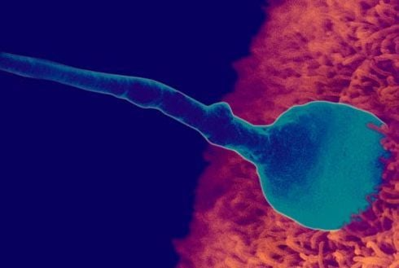
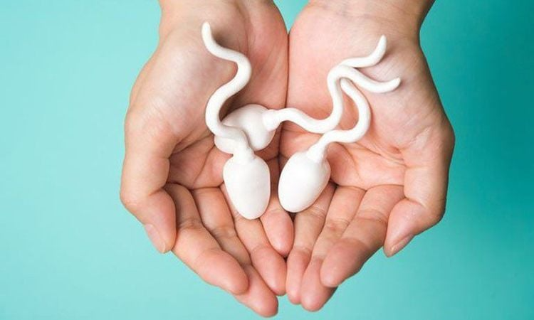

# Quá trình thụ tinh và mang thai

## Sự kết hợp của tinh trùng và trứng

Quá trình thụ thai chỉ có thể được xảy ra khi có đủ hai yếu tố quan trọng là tinh trùng và trứng.

#### Tế bào trứng:

* Trứng được sản xuất bởi [buồng trứng](https://www.vinmec.com/vie/co-the-nguoi/buong-trung-34) của phụ nữ. Sau mỗi [chu kỳ kinh nguyệt](https://www.vinmec.com/vie/bai-viet/chu-ky-kinh-nguyet-tinh-tu-ngay-nao-vi), buồng trứng của phụ nữ sẽ rụng 1 – 3 quả trứng.
* Sau khi rụng, trứng phải đi qua ống dẫn trứng (dài khoảng 10cm) để đến [tử cung](https://www.vinmec.com/vie/co-the-nguoi/tu-cung-10).
* Thời gian tồn tại của trứng là 24 giờ sau khi rụng. Vì thế chỉ có thể thụ tinh trong khoảng thời gian này bạn mới có thể mang thai.
* Nếu vượt quá thời gian 24 giờ mà không được thụ tinh, trứng sẽ chết và được đẩy ra ngoài theo kinh nguyệt của kỳ kinh ngay tiếp sau đó.

<figure><figcaption>
Quá trình thụ thai chỉ có thể được xảy ra khi có đủ hai yếu tố quan trọng là tinh trùng và trứng.
</figcaption></figure>

#### Tinh trùng:

* Trái ngược cơ thể người đàn ông lại liên tục sản xuất tinh trùng.
* Thông thường mất khoảng 2 – 3 tháng để hình thành các tế bào tinh trùng mới. Các tế bào tinh trùng này có thể tồn tại vài tuần trong cơ thể nam giới.
* Khi xuất tinh, nam giới có thể giải phóng khoảng 40 – 300 triệu tinh trùng. Nhưng, chỉ có duy nhất một con tinh trùng khỏe mạnh nhất có thể gặp trứng.

Thời gian nhanh nhất khi tinh trùng gặp luôn được trứng tại đoạn đầu của vòi. Thời gian ước tính ngắn nhất mất khoảng 45 phút và chậm nhất là 12 tiếng. Tuy nhiên, nếu tinh trùng không gặp được trứng thì sẽ phải đợi trong khoảng thời gian từ 2-3 ngày khi trứng rụng để có thể thụ tinh.

***

## Quá trình thụ thai diễn ra như thế nào?

Sự kết hợp giữa tinh trùng của người bố và trứng của người mẹ chính là quá trình thụ thai:

* Khi xuất tinh có khoảng khoảng 40 đến 300 triệu tinh trùng vào âm đạo của phụ nữ.
* Tại đây, các tinh binh sẽ bắt đầu xuất phát tại những vị trí khác nhau trong âm đạo để đi tìm trứng.
* Hàng triệu tinh trùng sẽ bắt đầu cuộc đua với quãng đường dài khoảng 18cm từ cổ tử cung đến ống dẫn trứng để có thể thụ tinh cho trứng. Tinh trùng khỏe mạnh chỉ có thể di chuyển với tốc độ 2,5 cm mỗi 15 phút.
* Trở ngại đầu tiên mà các tinh trùng gặp phải trên đường đua chính là chất nhầy ở cổ tử cung. Vào những ngày quanh thời điểm trứng rụng, cổ tử cung tiết chất nhầy và trở nên lỏng, trơn, mịn giúp tinh trùng có thể bơi qua dễ dàng.
* Khi tinh trùng gặp trứng không có nghĩa là chúng đã kết hợp được với nhau ngay. Mà tinh trùng còn phải “phá vỏ trứng” để chui vào.
* Chỉ một [tinh trùng khỏe](https://www.vinmec.com/vie/bai-viet/dau-hieu-tinh-trung-khoe-manh-vi) nhất có thể vào trong vì sau khi đã có tinh trùng kết hợp với noãn. Trứng sẽ tiết ra chất làm lớp vỏ cứng lại để không còn tinh trùng khác chui vào.

<figure><figcaption>
Chỉ có một tinh trùng khỏe mạnh nhất mới có thể vào trong âm đạo của phụ nữ
</figcaption></figure>

## Quá trình thụ thai trong bao lâu?

Quá trình thụ thai được tính từ khi tinh trùng kết hợp với trứng tạo thành hợp tử. Cho tới lúc phôi thai làm tổ được trong tử cung. Sau khi thụ tinh khoảng 3 – 4 ngày, trứng đã thụ tinh. Tức hợp tử bắt đầu di chuyển dần vào tử cung tìm chỗ làm tổ và phân bào 3 lần trên đường đi.

Sau khi tìm được chỗ làm tổ thích hợp trong tử cung, phôi nang sẽ hình thành chân giả bám vào niêm mạc, hình thành [nhau thai](https://www.vinmec.com/vie/co-the-nguoi/nhau-thai-167). Quá trình làm tổ mất từ 7 – 10 ngày.

Nhìn chung, quá trình thụ thai sẽ mất từ 13 – 14 ngày. Tuy nhiên, không phải làm tổ xong nghĩa là bạn đã thụ thai thành công. Có 1/3 trường hợp trứng đã thụ tinh bám vào thành tử cung. Nhưng vẫn không mang thai do hợp tử gặp đột biến nhiễm sắc thể trong quá trình phân bào.

Để thụ thai chị em phụ nữ cần theo dõi những dấu hiệu của cơ thể như kinh nguyệt và các dấu hiệu báo mang thai sớm, hoặc nếu bị trễ kinh bạn có thể [sử dụng que thử thai tại nhà](https://www.vinmec.com/vie/bai-viet/dung-que-thu-thai-thay-1-vach-da-chac-chan-la-khong-co-thai-chua-vi), xét nghiệm máu để chắc chắn bản thân có mang thai hay không?

***

## Tham Khảo

1. [https://www.vinmec.com/vie/bai-viet/qua-trinh-thu-thai-dien-ra-nhu-nao-va-trong-bao-lau-vi](https://www.vinmec.com/vie/bai-viet/qua-trinh-thu-thai-dien-ra-nhu-nao-va-trong-bao-lau-vi)
2. [https://genesolutions.vn/tin-tuc/qua-trinh-thu-thai-dien-ra-the-nao/](https://genesolutions.vn/tin-tuc/qua-trinh-thu-thai-dien-ra-the-nao/)
3. [https://medlatec.vn/tin-tuc/thu-thai-la-gi-va-nhung-dieu-nen-biet-ve-qua-trinh-thu-thai-s74-n29253](https://medlatec.vn/tin-tuc/thu-thai-la-gi-va-nhung-dieu-nen-biet-ve-qua-trinh-thu-thai-s74-n29253)
