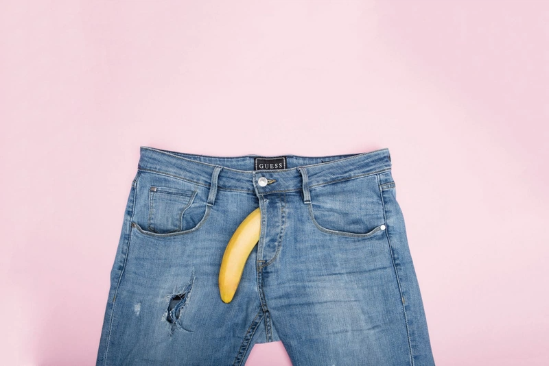

# Nam

Nam giới thường có thói quen tắm rửa qua loa thậm chí là lười tắm, điều này gián tiếp khiến cho dương vật dễ bị viêm nhiễm các loại vi khuẩn và dễ mắc các chứng như rận mu, [nấm vùng kín](https://nhathuoclongchau.com.vn/bai-viet/bi-nam-vung-kin-co-nguy-hiem-khong-54758.html)... Vì vậy, nam giới cần nắm được một số cách vệ sinh dương vật hằng ngày để đảm bảo dương vật luôn sách sẽ và khoẻ mạnh.

## Hệ quả khi không biết cách vệ sinh dương vật&#x20;

Có nhiều nam giới có thói quen xấu là không chú trọng vệ sinh dương vật khi tắm rửa, từ đó làm cho chất bẩn và tế bào chết đọng lại tạo thành bựa sinh dục khu vực quan bao quy đầu. Lâu ngày có thể dẫn tới tình trạng [viêm bao quy đầu](https://nhathuoclongchau.com.vn/bai-viet/dau-hieu-va-trieu-chung-cua-viem-bao-quy-dau-42934.html).

Bựa sinh dục được hình thành từ dầu và các tế bào da chết tích tụ lại, có mùi hôi. Tình trạng này thường thấy ở những người có quy đầu bị hẹp hoặc dài. Đây không phải là [bệnh lý bị lây nhiễm qua đường tình dục](https://nhathuoclongchau.com.vn/bai-viet/nhung-benh-pho-bien-lay-qua-duong-tinh-duc-nguy-hiem-47470.html), chúng cũng không ảnh hưởng nguy hiểm tới sức khỏe nam giới. Tuy nhiên nếu không vệ sinh dương vật đúng cách, để bựa sinh dục tồn tại lâu ở vùng kín của nam giới sẽ dẫn đến bốc mùi, chúng cứng lại sẽ hình thành viêm nhiễm, kích ứng gây nhiễm trùng dương vật.&#x20;

Cách để loại bỏ bựa dương vật cực kì đơn giản đó là biết cách vệ sinh dương vật đúng cách và giữ cho "cậu nhỏ" sạch sẽ mỗi ngày.

<figure><figcaption>
<em>Vệ sinh vùng kín nam đúng cách sẽ giúp "cậu nhỏ" luôn thơm tho, khoẻ mạnh</em>
</figcaption></figure>

***

## Hướng dẫn cách vệ sinh dương vật đúng cách

Vệ sinh vùng kín nam đúng cách là bao gồm vệ sinh cả dương vật và khu vực xung quanh "cậu nhỏ", kể cả vùng bìu và dưới bao quy đầu. Cách vệ sinh cậu nhỏ thơm tho, sạch sẽ như sau:

* Bước 1: Nhẹ nhàng kéo bao quy đầu (phần da bên ngoài) kéo xuống theo trục dương vật, kéo về gốc dương vật.
* Bước 2: Dùng [dung dịch vệ sinh nam giới ](https://nhathuoclongchau.com.vn/bai-viet/top-5-dung-dich-ve-sinh-nam-duoc-tin-dung-tren-thi-truong-hien-nay-58383.html)có độ pH dịu nhẹ để rửa sạch phần đầu "cậu nhỏ", vẫn có thể dùng nước sạch nếu không có dung dịch vệ sinh chuyên dụng. Lưu ý không nên chà mạnh mà chỉ cần massage nhẹ nhàng vì là đã khó thể loại bỏ bựa sinh dục. Vùng da này khá mỏng manh nên cần làm nhẹ nhàng.
* Bước 3: Rửa lại dương vật bằng nước sạch. Nên xả nước vào vùng kín từ từ, không nên dùng vòi xịt mạnh vì dễ khiến vùng da tại đây bị tổn thương.
* Bước 4: Vẩy hoặc dùng khăn lau khô.
* Bước 5: Kéo bao quy đầu về như ban đầu.

Nếu bựa sinh dục đã bị cứng thì không nên cố gắng gỡ chúng ra vì như vậy rất dễ làm dương vật bị tổn thương và khiến vùng da này bị nhiễm trùng. Muốn loại bỏ [bựa sinh dục](https://nhathuoclongchau.com.vn/bai-viet/bua-sinh-duc-la-gi-do-nguyen-nhan-nao-gay-nen-62506.html) cứng thì hãy làm mềm chúng trước, sau đó xoa hoặc ngâm nước ấm, nhờ đó sẽ rửa trôi chúng dễ dàng hơn và không gây đau.

Việc vệ sinh dương vật nên được thực hiện hàng ngày trong lúc tắm rửa. Ngoài ra, thông qua việc vệ sinh mà bạn phát hiện dương vật bị viêm hoặc sưng đỏ thì hãy nhanh chóng đi khám vì rất có thể đây là triệu chứng của bệnh lý sinh dục nào đó.

<figure><figcaption>
<em>Có thể kết hợp vệ sinh vùng kín trong lúc tắm</em>
</figcaption></figure>

***

## Một số lưu ý khác về việc giữ vệ sinh dương vật

### Nên “dọn cỏ cho cậu nhỏ" không?

Lông vùng kín có công dụng ngăn vi khuẩn xâm nhập và gây hại khu vực nhạy cảm này. Tuy nhiên một số người cảm thấy phần lông ở đây quá rậm rạp, gây mất thẩm mỹ hoặc có mùi nên họ đã quyết định tự "dọn cỏ" bằng cách sử dụng dao cạo.

Nếu thao tác [cạo lông vùng kín](https://nhathuoclongchau.com.vn/bai-viet/cao-long-vung-kin-nam-co-anh-huong-gi-khong-63504.html) không cẩn thận sẽ làm da bị trầy xước và chảy máu, dễ gây nhiễm trùng. Ngoài ra chỉ một thời gian ngắn sau thì lông sẽ lại mọc trở lại và thậm chí còn khiến bạn cảm thấy ngứa ngáy. Lông mọc lại sẽ cứng và nhiều hơn. Do đó, nếu thấy phần lông vùng kín gây mất thẩm mỹ và sự tự tin thì bạn chỉ nên cắt ngắn chứ không nên cạo trụi nó.

Để "dọn cỏ" vùng kín, bạn nên dùng kéo hoặc tông đơ dành riêng cho công việc này, không được dùng chúng vào các việc khác để tránh lây lan vi khuẩn.

Bên cạnh việc "dọn cỏ" thì bạn cũng có thể tham khảo đến phương pháp triệt lông bằng công nghệ laser. Công nghệ này sẽ phá vỡ cấu trúc của lông, khiến lông không thể mọc lại, nếu có thì sẽ rất thưa và mảnh dần, đảm bảo tính thẩm mỹ.

\

<figure><figcaption>
<em>Việc dọn cỏ vùng kín nam giới tuỳ thuộc vào nhu cầu mỗi người</em>
</figcaption></figure>

### Chọn đồ lót cho nam giới&#x20;

Nam giới nên mặc những loại quần lót có chất liệu mỏng nhẹ, thoáng mát, thấm hút mồ hôi tốt. [Không nên mặc quần bó sát](https://nhathuoclongchau.com.vn/bai-viet/tac-hai-khi-mac-quan-lot-chat-voi-nam-gioi-66111.html) vì sẽ gây ảnh hưởng tới tinh hoàn do làm tăng nhiệt độ nơi đây, ngoài ra quần bó sát dễ tích đọng bựa sinh dục, tạo cảm giác không thoải mái trong các hoạt động hàng ngày.

Không mặc đồ lót chưa khô hoàn toàn hoặc đồ bị ướt vì dễ khiến vi khuẩn phát triển và gây hại cho vùng kín. Ví dụ như sau khi đi mưa về hoặc sau một buổi tập luyện thể thao ra nhiều mồ hôi thì bạn nên nhanh chóng thay quần lót khác. Ngoài ra nên thay mới đồ lót 6 tháng/lần.

Trên đây là một vài [cách vệ sinh dương vật](https://nhathuoclongchau.com.vn/bai-viet/huong-dan-cach-ve-sinh-duong-vat-hang-ngay-71158.html) hằng ngày. Hi vọng với những thông tin hữu ích trên, quý đọc giả đã có thêm kiến thức hữu ích trong việc giữ vệ sinh vùng kín để hạn chế viêm nhiễm một cách tốt nhất.

***

## Quiz



***

## Tham Khảo&#x20;

1. [https://nhathuoclongchau.com.vn/bai-viet/huong-dan-cach-ve-sinh-duong-vat-hang-ngay-71158.html](https://nhathuoclongchau.com.vn/bai-viet/huong-dan-cach-ve-sinh-duong-vat-hang-ngay-71158.html)
2. [https://medlatec.vn/tin-tuc/huong-dan-cac-ban-trai-cach-ve-sinh-duong-vat-hang-ngay-s78-n28204](https://medlatec.vn/tin-tuc/huong-dan-cac-ban-trai-cach-ve-sinh-duong-vat-hang-ngay-s78-n28204)

