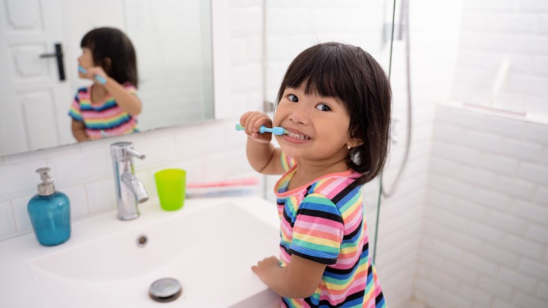
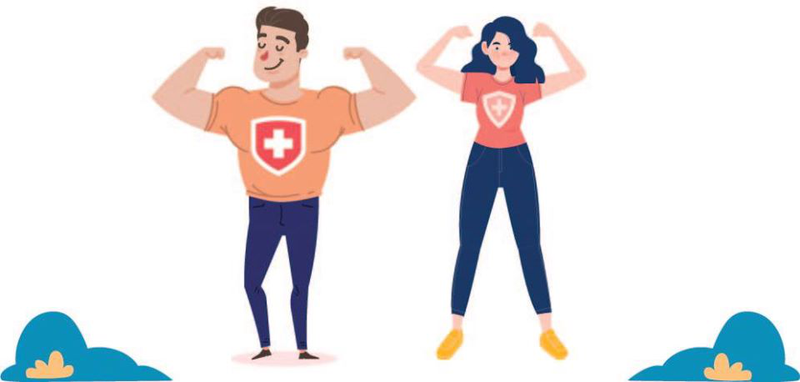

# Vệ sinh cơ thể hàng ngày

## Vệ sinh cá nhân là gì?

Vệ sinh cá nhân bao gồm các hành động chăm sóc cơ thể mà mọi người nên thực hiện thường xuyên. Điều này có thể được thực hiện trong phòng tắm, phòng ngủ hoặc bất kỳ không gian riêng tư nào.

<figure><figcaption>
<em>Vệ sinh cá nhân là hoạt động  giữ vệ sinh của mỗi người</em>
</figcaption></figure>

### Lợi ích của việc vệ sinh cá nhân tốt

Khi bạn làm sạch cơ thể, bạn sẽ cảm thấy tự tin và tràn đầy năng lượng hơn. Vệ sinh cá nhân không chỉ ảnh hưởng đến sức khỏe thể chất mà còn nâng cao sức khỏe tinh thần. Tuy nhiên, không phải ai cũng có ý thức giữ gìn vệ sinh bản thân thường xuyên. Vì vậy, chúng ta cần những lý do thuyết phục hơn để thúc đẩy việc xây dựng và duy trì thói quen vệ sinh sạch sẽ ngay từ lứa tuổi trẻ nhất.

### Ảnh hưởng sức khỏe của việc vệ sinh cá nhân kém

Thiếu vệ sinh cá nhân có thể dẫn đến nhiều vấn đề sức khỏe khác nhau, bao gồm nhiễm trùng, các vấn đề về da và [giảm khả năng miễn dịch tổng thể](https://nhathuoclongchau.com.vn/bai-viet/luu-lai-ngay-cac-dau-hieu-nhan-biet-he-mien-dich-kem.html). Vệ sinh kém cũng có thể góp phần gây ra các vấn đề xã hội và tâm lý, vì nó ảnh hưởng đến lòng tự trọng và các tương tác xã hội của một người.

### Thúc đẩy thói quen vệ sinh cá nhân

Tạo thói quen và giáo dục trẻ từ khi còn nhỏ về tầm quan trọng của việc giữ gìn vệ sinh cá nhân. Những thói quen đơn giản như rửa tay thường xuyên, tắm hàng ngày và giữ quần áo sạch sẽ có thể tạo ra sự khác biệt đáng kể. Cha mẹ và các nhà giáo dục đóng vai trò quan trọng trong việc hình thành những thói quen này từ sớm, đảm bảo rằng trẻ lớn lên hiểu được tầm quan trọng của sự sạch sẽ đối với sức khỏe.

***

## Tại sao vệ sinh cá nhân lại quan trọng?

Như đã đề cập bên trên, giữ gìn vệ sinh cá nhân tốt là rất quan trọng đối với sức khỏe và hạnh phúc tổng thể. Thực hành này không chỉ giúp bạn sạch sẽ mà còn bảo vệ bạn khỏi vi khuẩn gây bệnh. Vệ sinh cá nhân đúng cách mang lại nhiều lợi ích cho cả sức khỏe và tương tác xã hội.

### Lợi ích sức khỏe của vệ sinh cá nhân

Duy trì giữ gìn vệ sinh cá nhân đúng cách sẽ tăng cường sức khỏe của bạn một cách đáng kể. Ví dụ, đánh răng và dùng chỉ nha khoa giúp ngăn ngừa các bệnh về răng miệng bằng cách loại bỏ mảng bám và vi khuẩn. Rửa tay là một thực hành thiết yếu khác, vì nó giúp loại bỏ vi khuẩn có hại và ngăn ngừa sự lây lan của bệnh tật. Bằng cách giữ gìn vệ sinh cá nhân tốt, bạn không chỉ bảo vệ sức khỏe của mình mà còn cả sức khỏe của gia đình bạn.

<figure><figcaption>
<em>Giữ gìn vệ sinh cá nhân tốt sẽ làm tăng khả năng miễn dịch cho cơ thể</em>
</figcaption></figure>

### Lợi ích xã hội của vệ sinh cá nhân

Vệ sinh cá nhân tốt là điều cần thiết cho các tương tác xã hội tích cực. Nhiều nền văn hóa coi vệ sinh cá nhân kém là bất lịch sự và xúc phạm, thường liên quan đến bệnh tật. Chăm sóc cơ thể thường xuyên giúp giảm mùi cơ thể và cải thiện ngoại hình tổng thể, giúp bạn dễ chịu hơn khi ở gần. Điều này đặc biệt quan trọng trong các tình huống xã hội như đi học, đi làm hoặc bất kỳ môi trường công cộng nào.

### Danh sách những việc nên nhớ để giữ gìn vệ sinh cá nhân tốt

Duy trì vệ sinh cá nhân tốt là điều quan trọng đối với sức khỏe và tinh thần tổng thể của bạn. Dưới đây là danh sách những thói quen cần thiết cần áp dụng để có một cuộc sống khỏe mạnh hơn.

#### Tắm thường xuyên

Tắm thường xuyên là rất quan trọng, đặc biệt là khi bạn bẩn hoặc đổ mồ hôi. Điều này giúp loại bỏ bụi bẩn, mồ hôi và vi khuẩn khỏi da, giảm nguy cơ nhiễm trùng da và mùi cơ thể.

#### Đánh răng

Đánh răng không chỉ giữ vệ sinh răng miệng mà còn bảo vệ khỏi các bệnh về răng miệng và ngăn ngừa hôi miệng. Chải ít nhất hai lần một ngày và dùng [chỉ nha khoa](https://nhathuoclongchau.com.vn/cham-soc-ca-nhan/chi-nha-khoa) hàng ngày.

#### Giặt quần áo của bạn

Giặt giũ thường xuyên là điều cần thiết để loại bỏ mồ hôi và bụi bẩn, đảm bảo vệ sinh cá nhân và ngăn ngừa nhiễm trùng da.

#### Giặt ga trải giường thường xuyên

Bộ đồ giường liên tục tiếp xúc với chất dịch cơ thể như mồ hôi khi bạn ngủ. Thay và giặt ga trải giường hàng tuần hoặc ngay khi nó trông bẩn để duy trì sự sạch sẽ và ngăn ngừa các vấn đề về da.

<figure><figcaption>
<em>Cắt móng tay giúp hạn chế vi khuẩn lây bệnh</em>
</figcaption></figure>

#### Cắt móng tay

Thường xuyên cắt tỉa móng tay để giữ chúng gọn gàng và sạch sẽ. Móng tay dài, bẩn hoặc móng tay bị cắn có thể chứa vi khuẩn và trông kém hấp dẫn. Nếu bạn có móng tay dài và sơn móng tay, hãy giữ chúng ở tình trạng tốt nhất có thể.

#### Rửa tay bằng xà phòng

Rửa tay thường xuyên bằng xà phòng hoặc [nước rửa tay](https://nhathuoclongchau.com.vn/cham-soc-ca-nhan/nuoc-rua-tay), đặc biệt là sau khi tiếp xúc với thịt sống hoặc bất kỳ ai bị bệnh. Cứ sau 3 phút, bàn tay của bạn có thể bị nhiễm vi khuẩn, vì vậy việc rửa tay thường xuyên là điều cần thiết để ngăn chặn sự lây lan của vi trùng.

#### Che miệng bằng khăn giấy khi ho hoặc hắt hơi

Che miệng bằng khăn giấy giúp ngăn ngừa sự lây lan của vi khuẩn sang người khác. Nếu bạn sử dụng tay, hãy nhớ rửa tay ngay sau đó.

#### Thay tất thường xuyên hơn

Nhiều người lơ là việc thay tất thường xuyên nhưng đây lại là một thói quen không tốt. Mang tất trong môi trường kín tạo ra độ ẩm, tạo điều kiện cho vi khuẩn phát triển. Thay tất thường xuyên để [ngăn ngừa mùi hôi chân](https://nhathuoclongchau.com.vn/bai-viet/goi-y-mot-so-thuoc-tri-hoi-chan-hieu-qua-nhat-ma-ban-nen-dung-64208.html) và nhiễm trùng.

#### Không chia sẻ vật dụng cá nhân

Dùng chung các vật dụng cá nhân như lược, mỹ phẩm, tai nghe có thể dẫn đến lây lan dịch bệnh. Để đảm bảo sức khỏe cho chính mình, hãy hạn chế tối đa việc chia sẻ những vật dụng này với người khác. Ưu tiên sức khỏe và vệ sinh bằng cách để riêng các vật dụng cá nhân.

<figure><figcaption>
<em>Nên có bộ đồ dùng vệ sinh cá nhân để dùng khi cần thiết</em>
</figcaption></figure>

Tóm lại, vệ sinh cá nhân không chỉ là nhìn và ngửi mà đó là một thực hành quan trọng để duy trì sức khỏe và ngăn ngừa bệnh tật. Bằng cách kết hợp các thói quen [giữ gìn vệ sinh cá nhân](https://nhathuoclongchau.com.vn/bai-viet/9-viec-can-nho-de-giu-gin-ve-sinh-ca-nhan-tot.html) đơn giản vào thói quen hàng ngày, bạn có thể bảo vệ bản thân và những người xung quanh khỏi bệnh tật. Hơn nữa, vệ sinh tốt tác động tích cực đến đời sống xã hội của bạn, khiến bạn tự tin và dễ gần hơn. Ưu tiên vệ sinh cá nhân để có cuộc sống khỏe mạnh, hạnh phúc hơn bạn nhé.

***

## Quiz



***

## Tham Khảo

1. [https://nhathuoclongchau.com.vn/bai-viet/9-viec-can-nho-de-giu-gin-ve-sinh-ca-nhan-tot.html](https://nhathuoclongchau.com.vn/bai-viet/9-viec-can-nho-de-giu-gin-ve-sinh-ca-nhan-tot.html)
2. [https://toantamvn.com/loi-ich-cua-viec-duy-tri-ve-sinh-ca-nhan-hang-ngay](https://toantamvn.com/loi-ich-cua-viec-duy-tri-ve-sinh-ca-nhan-hang-ngay)
3. [https://www.watsons.vn/vi/blog/vi/suc-khoe/nguyen-tac-ve-sinh-ca-nhan](https://www.watsons.vn/vi/blog/vi/suc-khoe/nguyen-tac-ve-sinh-ca-nhan)

