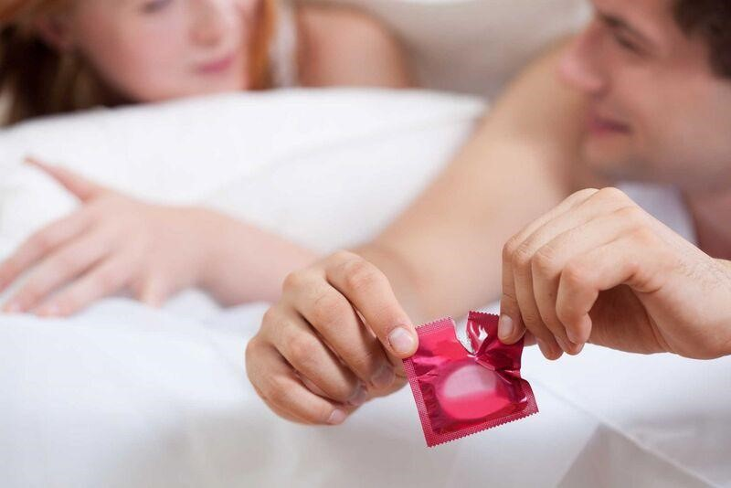

# Giới Thiệu về Quan Hệ Tình Dục

## Quan hệ tình dục đều đặn và lành mạnh mang lại lợi ích gì?

Quan hệ tình dục đều đặn và lành mạnh có thể mang lại nhiều lợi ích về sức khỏe thể chất. Những cặp đôi hòa hợp trong đời sống tình dục thì cũng trở nên gắn kết hơn và tỷ lệ ly hôn sẽ thấp hơn.

<figure><figcaption>
<em>Quan hệ lành mạnh mang lại nhiều lợi ích về sức khỏe thể và tinh thần</em>
</figcaption></figure>

* Quan hệ tình dục đúng cách mang lại nhiều lợi ích về tâm lý:
  * Nhận thức tốt hơn, tích cực hơn về hình ảnh của bản thân.
  * Đời sống tình dục hòa hợp giúp các cặp đôi có cảm giác hạnh phúc hơn.
  * Tăng cơ hội gắn kết: Khi quan hệ tình dục, não sẽ giải phóng ra nhiều loại hormone, bao gồm cả endorphin có tác dụng giảm bớt cảm giác cáu gắt hay chán nản. Bên cạnh đó, hormone oxytocin cũng được giải phóng từ não khi quan hệ tình dục, giúp cặp đôi có cảm giác thư thái, mãn nguyện.

\+ Giảm căng thẳng: Quan hệ tình dục cũng chính là cách làm giảm những loại hormone có phản ứng với tâm lý căng thẳng như cortisol và epinephrine. Tác dụng này còn có thể kéo dài sang ngày hôm sau.

\+ Tăng chất lượng giấc ngủ: Hoạt động quan hệ tình dục sẽ kích thích cơ thể giải phóng prolactin. Đây chính là một loại hormone giúp bạn có một giấc ngủ ngon.

* Hoạt động tình dục thường xuyên cùng góp phần tăng cường sức khỏe thể chất:

\+ Giúp bạn có thể lực tốt hơn: Khi hoạt động tình dục, bạn cũng phải tiêu hao lượng calo tương đương với một số bài tập thể dục chạy bộ, leo cầu thang,... Do đó, quan hệ tình dục cũng có thể coi như một hình thực tập luyện, giúp bạn tăng cường thể lực. Với nam giới, hoạt động này giúp săn chắc cơ bụng và cơ vùng chậu. Với nữ giới, hoạt động tình dục giúp chị em nâng cao khả năng kiểm soát bàng quang.

\+ Tốt cho não bộ, tăng cường miễn dịch và hỗ trợ giảm đau.

\+ Giảm cân: Nếu bạn quan hệ trong khoảng 30 phút, cơ thể đốt cháy khoảng 200 calo, từ đó hỗ trợ giảm cân hiệu quả.

\+ Tốt cho sức khỏe tim mạch: Khi tiếp xúc thân mật có thể làm giãn mạch máu, thúc đẩy quá trình vận chuyển oxy và dưỡng chất đến khắp cơ thể. Từ đó, có thể cải thiện sức khỏe tim mạch.

***

## Các bước quan hệ tình dục ở nam giới

Dưới đây là các bước quan hệ tình dục ở nam giới

* Giai đoạn kích thích

Kéo dài trong khoảng vài phút cho đến vài giờ. Lúc này, “cậu nhỏ” bắt đầu có biểu hiện cương cứng lên một chút, núm vú cứng hơn. Nhịp tim, nhịp thở và huyết áp đều tăng.

* Giai đoạn hưng phấn: Toàn bộ dương vật cương cứng. Nhịp thở tăng. Một số vùng trên cơ thể như vùng bụng, vùng ngực, vai, cổ hay mặt có biểu hiện nóng lên và da đỏ hơn. Cùng lúc này, cơ bắp ở đùi, tay, hông và mông bắt đầu gồng cứng hay co thắt lại.

<figure><figcaption>
<em>Hòa hợp trong đời sống chăn gối cũng là yếu tố giúp giảm tỷ lệ ly hôn</em> 
</figcaption></figure>

* Giai đoạn cực khoái: Chỉ diễn ra khoảng vài giây nhưng là giai đoạn đỉnh điểm. Những cơn co thắt bắt đầu xảy ra, nhịp thở, huyết áp và cơ bắp ngày càng tăng lên và tinh dịch sẽ được tiết từ hành niệu đạo và giải phóng ra khỏi dương vật.
* Giai đoạn phục hồi: Thời gian phục hồi là tùy vào từng cặp đôi, có thể chỉ vài phút nhưng cũng có thể diễn ra khoảng nửa giờ. Sau khi xuất tinh, phải mất một khoảng thời gian nữa “cậu nhỏ” mới có thể đạt cương cứng khi quan hệ. Tuy nhiên khoảng cách giữa mỗi lần cương cứng ở mỗi người là khác nhau, điều này có thể dựa vào độ tuổi, thể trạng của nam giới hoặc một số yếu tố khác. Sau quan hệ, da cũng không bị đỏ và các cơ được thư giãn.

***

## Lưu ý

\- Dùng nước ấm để vệ sinh sạch sẽ vùng kín trước và sau khi quan hệ để tránh nguy cơ bị viêm nhiễm, chẳng hạn viêm bao quy đầu hay một số bệnh nam khoa khác.

\

<figure><figcaption>
<em>Dùng bao cao su giúp phòng tránh nhiều bệnh lây truyền qua đường “yêu”</em>
</figcaption></figure>

\- Nên đi tiểu ngay sau khi quan hệ để phòng tránh nguy cơ nhiễm trùng.

\- Không quan hệ tình dục khi [mệt mỏi](https://medlatec.vn/tin-tuc/met-moi-moi-ngay--trieu-chung-khong-the-xem-thuong-s195-n19178): Nếu quan hệ tình dục trong thời điểm này, bạn có nguy cơ giảm khoái cảm, mệt mỏi hơn, dễ bị đau đầu, xuất tinh sớm, liệt dương và một số bệnh lý khác.

\- Hạn chế quan hệ khi đang điều trị bệnh để tránh lây nhiễm bệnh cho đối phương. Hơn nữa, quan hệ trong thời điểm này còn có thể làm giảm sức đề kháng khiến bệnh tiến triển nhanh hơn. Bên cạnh đó, khi đang có bệnh, chất lượng tinh trùng cũng bị suy giảm và đây không phải là thời điểm tốt nhất để thụ thai.

\- Không quan hệ khi phụ nữ đang trong thời kỳ kinh nguyệt hoặc đang mang thai (nhất là giai đoạn 3 tháng đầu).

\- [Dùng bao cao su](https://medlatec.vn/tin-tuc/cach-dung-bao-cao-su-dung-cho-nam-gioi-trong-quan-he-tinh-duc-s195-n17955) khi quan hệ.

<figure><figcaption>
<em>Tần suất “yêu” của mỗi cặp đôi là khác nhau</em>
</figcaption></figure>

\- Tần suất quan hệ: Đây cũng là yếu tố rất quan trọng đối với sức khỏe và hạnh phúc hôn nhân. Với người khỏe mạnh, có thể quan hệ tình dục khoảng 3 lần mỗi tuần. Nhưng một số cặp đôi chỉ quan hệ 1 đến 2 lần mỗi tuần. Rất khó để đưa ra một con số cụ thể về tần suất quan hệ lý tưởng. Tuy nhiên, càng lớn tuổi thì nhu cầu tình dục sẽ càng giảm.

Các cặp đôi nên trao đổi cởi mở về nhu cầu thực sự của nhau và đưa ra những lựa chọn phù hợp. Nên căn cứ vào độ tuổi, thể trạng sức khỏe, tâm trạng, mức độ mệt mỏi sau mỗi lần quan hệ để điều chỉnh tần suất quan hệ sao cho phù hợp.

***

## Tham Khảo

1. [https://medlatec.vn/tin-tuc/cac-buoc-quan-he-tinh-duc-va-nhung-dieu-can-luu-y](https://medlatec.vn/tin-tuc/cac-buoc-quan-he-tinh-duc-va-nhung-dieu-can-luu-y)
2. [https://www.vinmec.com/vie/bai-viet/12-loi-khuyen-thoi-diem-va-vi-tri-de-lam-chuyen-ay-vi](https://www.vinmec.com/vie/bai-viet/12-loi-khuyen-thoi-diem-va-vi-tri-de-lam-chuyen-ay-vi)

\

\
