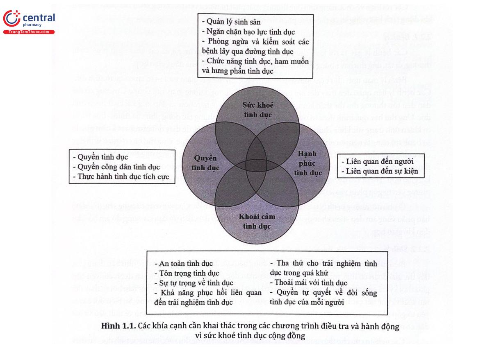

# Đại Cương về Sức Khỏe Tình Dục

## 1. MỘT SỐ ĐỊNH NGHĨA VÀ KHÁI NIỆM 

### Sức khỏe tình dục 

#### **Lịch sử hình thành khái niệm Sức khoẻ tình dục**

Năm 1994, “Sức khoẻ tình dục” lần đầu tiên được Tổ chức Y tế thế giới (WHO) định nghĩa tương đối mơ hồ: “là sự tích hợp của các khía cạnh cơ thể, cảm xúc, trí tuệ và xã hội về tình dục, theo những phương thức phong phú tích cực và nâng cao nhân cách, sự giao tiếp và tình yêu con người”.

Năm 1994, Chương trình hành động của Liên hợp quốc trong Hội nghị quốc tế về Dân số và Phát triển (ICPD) đã đưa sức khoẻ tình dục vào định nghĩa sức khoẻ sinh sản, cho thấy mục đích là “nâng cao đời sống và các mối quan hệ cá nhân, không chỉ đơn thuần là tư vấn và chăm sóc liên quan đến sinh sản và các bệnh lây truyền qua đường tình dục”. Từ đó, định nghĩa này được sử dụng rộng rãi bởi các tổ chức trên thế giới như WHO và Liên đoàn quốc tế về Kế hoạch hoá gia đình (IPPK), với ý nghĩa quan trọng về cách tiếp cận sức khoẻ tình dục của các quốc gia và xã hội.

#### **Khái niệm**

Sức khỏe tình dục là trạng thái thoải mái về thể chất, tỉnh thần và xã hội liên quan đến tình dục, không chỉ đơn thuần là không có bệnh tật hay rối loạn chức năng về tình dục, được tiếp cận tích cực và tôn trọng các mối quan hệ về tình dục cũng như khả năng có những trải nghiệm tình dục an toàn và vui vẻ, không bị ép buộc, phân biệt đối xử và bạo lực.

Nhìn nhận một cách tổng thể và tích cực:

* Sức khỏe tình dục là về hạnh phúc, không chỉ đơn thuần là không có bệnh tật.
* Sức khỏe tình dục có liên quan đến sự tôn trọng an toàn, không bị phân biệt đối xử và bạo lực.
* Sức khỏe tình dục phụ thuộc vào việc thực hiện các quyền nhất định của con người.
* Sức khỏe tình dục có liên quan trong suốt cuộc đời của mỗi cá nhân, không chỉ đối với những người đang trong độ tuổi sinh sản, mà còn đối với cả người trẻ và người già.
* Sức khỏe tình dục được thể hiện thông qua giới tính và hình thức biểu hiện tình dục đa dạng.
* Sức khỏe tình dục bị ảnh hưởng nghiêm trọng bởi các chuẩn mực giới tính, vai trò, kỳ vọng và động lực quyền lực.
* Sức khỏe tình dục cần được hiểu trong bối cảnh xã hội, kinh tế và chính trị cụ thể.

### Tính dục 

#### **Khái niệm**

Tính dục là một khía cạnh trung tâm của con người trong suốt cuộc đời bao gồm tình dục, bản dạng giới và vai trò, khuynh hướng tình dục, sự khiêu gợi, khoái cảm, sự gần gũi và sinh sản. Khả năng tình dục được trải nghiệm và thể hiện trong những suy nghĩ, tưởng tượng mong muốn, niềm tin, thái độ, giá trị, hành vị, thực hành, vai trò và các mối quan hệ. Mặc dù khả năng tình dục có thể bao gồm tất cả các yếu tố này, nhưng không phải tất cả chúng đều luôn được thể hiện. Khả năng tình dục chịu sự tác động qua lại của các yếu tố sinh học, tâm lý, xã hội, kinh tế, chính trị, văn hóa, luật pháp, lịch sử, tôn giáo và tâm linh.

#### **Xu hướng tính dục**

Xu hướng tính dục (hay còn gọi là thiên hướng tính dục) là khái niệm đề cập tới sự hấp dẫn lâu dài, bền vững về thể chất, cảm xúc lãng mạn, hoặc tình cảm, tình dục của một người với một giới bất kỳ. Nó khác với 3 cấu thành khác của tính dục bao gồm giới tính sinh học (cơ quan sinh dục), bản dạng giới (cảm nhận tâm lý mình là nam hay nữ), và vai trò giới (sự tham gia vào quan niệm xã hội về hành vi nam tính hay nữ tính). Xu hướng tính dục không giống với hành vi tình dục bởi vì nó đề cập tới cả cảm nhận và quan niệm cá nhân. Từng cá nhân có thể thể hiện xu hướng tính dục của mình thông qua hành vi tình dục của họ và cũng có thể không.

#### **Một số xu hướng tính dục thường gặp:**

* Dị tính (Straight/Heterosexual): là những người bị hấp dẫn tình dục bởi người khác giới, đây là xu hướng tình dục phổ biến nhất.
* [Đồng](https://trungtamthuoc.com/hoat-chat/dong) tính nữ (Lesbian): là những phụ nữ có cảm xúc và ham muốn tình dục với người cùng giới nữ.
* Đồng tính nam (Gay): là những nam giới bị thu hút bởi cùng nam giới.
* Songtính/Lưỡng tính (Bisexual): là nhóm người có ham muốn tình dục với cả hai giới, gồm lưỡng tính thật (do bất thường trong quá trình phát triển bào thai mà tồn tại cả hai loại cơ quan sinh dục nam và nữ) và lưỡng tính giả (cơ quan sinh dục hoàn chỉnh).
* Người chuyển giới (Transgender): là nhóm người có bản dạng giới (suy nghĩ, hành động) trái ngược với giới tính sinh học; bị thôi thúc, khao khát phẫu thuật để chuyển đồi giới tính cho phù hợp với bản dạng giới của mình.
* Vô tính (Asexual): là nhóm người không có cảm xúc, tình cảm hay ham muốn tình dục với bất kỳ giới nào song vẫn có thể quan hệ tình dục hoặc thậm chí kết hôn để phù hợp với thuần phong mỹ tục, hay chỉ đơn giản là thích được chiều chuộng, thư giãn.
* Toàn tính (Pansexual): là những người bị thu hút bởi tính lãng mạn, ham muốn tình dục với một cá thể mà không phụ thuộc vào giới tính. Trong khi những người song tính bị thu hút bởi hai giới nam và nữ thì những người toàn tính có thể bị hấp dẫn bởi cả người chuyền giới.
* Ái tính (Demissexual): là những người bị hấp dẫn tình dục sau khi đã có mối quan hệ tình cảm với một người nào đó mà không quan tâm đến giới tính của họ.

Thuật ngữ “LGBT” được hình thành bởi 4 xu hướng tính dục phồ biến gồm: Lesbian, Gay, Bisexual và Transgender. Tuy nhiên, khi y học giới tính phát triển, các khía cạnh về xu hướng tính dục của con người càng được tìm hiểu sâu rộng hơn thì xuất hiện thêm các xu hướng tính dục khác. Do vậy, hiện nay, để chỉ cộng đồng bên cạnh dị tính thì cụm từ LGBT đã được mở rộng thành “LGBT+”.

### Quyền tình dục 

Việc hoàn thiện sức khỏe tình dục gắn liền với mức độ mà các quyền con người được tôn trọng, bảo vệ và thực hành. Quyền tình dục bao hàm một số quyền con người đã được thừa nhận trong các văn kiện nhân quyền quốc tế và khu vực cũng như các văn bản đồng thuận khác và trong luật pháp của từng quốc gia.

#### **Các quyền quan trọng đối với việc nhận thức sức khỏe tình dục bao gồm:**

* Quyền bình đẳng và không phân biệt đối xử.
* Quyền không bị tra tấn hoặc đối xử hoặc trừng phạt tàn bạo, vô nhân đạo hoặc hạ nhục.
* Quyền riêng tư.
* Quyền đối với tiêu chuẩn sức khỏe cao nhất có thể đạt được (bao gồm sức khỏe tình dục) và an sinh xã hội.
* Quyền kết hôn, lập gia đình và với sự đồng ý của đối tượng, quyền bình đẳng trong hôn nhân và khi ly hôn.
* Quyền quyết định số lượng và thời gian giữa những lần sinh con.
* Quyền về thông tin và giáo dục.
* Quyền tự do quan điểm và ngôn luận.
* Quyền được khắc phục hiệu quả đối với những vi phạm các quyền cơ bản.

Việc thực hiện các quyền con người một cách có trách nhiệm đòi hỏi tất cả mọi người phải tôn trọng các quyền của người khác. Việc áp dụng các quyền hiện có của con người đối với khả năng tình dục và sức khỏe tình dục cấu thành các quyền tình dục. Quyền tình dục bảo vệ tất cả các quyền của mọi người được thực hiện và thể hiện khía cạnh tình dục của họ cũng như được hưởng sức khỏe tình dục, tôn trọng quyền của người khác trong khuôn khổ bảo vệ chống lại sự phân biệt đối xử.

Các chính sách, quy định của pháp luật rất quan trọng trong việc đặt ra những quy tắc và khuôn khổ cho hành vi của con người trong xã hội, có thể góp phần phát triển hoặc cản trở sự phát triển của các dịch vụ hay chương trình chăm sóc sức khoẻ tình dục, cho phép hoặc vô hiệu hoá sự tiếp cận thông tin để bảo vệ sức khoẻ tình dục và thực hiện các quyền tình dục của con người. Các quy định pháp luật có thể thể hiện sự tôn trọng và bảo vệ quyền con người, như tạo ra sự bình đẳng trong mọi lĩnh vực của cuộc sống bất kể xu hướng tính dục, bản dạng giới hay biểu hiện giới tính. Mặt khác, luật pháp tại một số quốc gia cũng có thể tạo ra những hạn chế đối với sức khoẻ và khoái cảm tình dục, ví dụ như hạn chế quyền tình dục của nhóm LGBT. Bên cạnh đó, luật pháp và chính sách về sức khoẻ và khoái cảm tình dục tại một số quốc gia bị ảnh hưởng bởi những điều cấm ky trong văn hoá xã hội, có thể kể đến như hành vi tình dục đồng giới, biểu hiện của người chuyển giới, mại dâm, ngăn cấm tránh thai hoặc phá thai...

### Khoái cảm tình dục 

Khoái cảm tình dục là sự thoả mãn và thích thú về thể chất và/hoặc tâm lý bắt nguồn từ những trải nghiệm tình dục đơn độc hoặc được chia sẻ, bao gồm cả suy nghĩ, giấc mơ tự phát. Quyền tự quyết, sự đồng ý, an toàn, riêng tư, tự tin và khả năng giao tiếp trong quan hệ tình dục là những yếu tố chính có khả năng tạo nên sức khoẻ và hạnh phúc tình dục. Khoái cảm tình dục nên được thực hiện trong bối cảnh, quyền tình dục, đặc biệt là quyền bình đẳng và không phân biệt đối xử, quyền tự chủ và toàn vẹn cơ thể, quyền đạt được tiêu chuẩn sức khoẻ và quyền tự do ngôn luận. Những trải nghiệm về khoái cảm tình dục. của con người rất đa dạng và quyền tình dục đảm bảo rằng khoái cảm là một trải nghiệm tích cực, phải có được bằng xâm phạm nhân quyền và lợi ích của người khác.

Mốii liên hệ giữa khoái cảm tình dục và sức khoẻ tình dục đã được hiểu từ lâu. Sức khoẻ tình dục hiện nay cũng được công nhận là có liên quan mật thiết với mức độ bảo vệ quyền con người. Tuy nhiên, vẫn chưa có sự quan tâm đầy đủ và đúng mực đến vấn đề này, đặc biệt là đối tượng vị thành niên. Mặc dù đó cũng là quyền cơ bản của con người, việc tìm kiếm khoái cảm tình dục tự phát, thiếu hiểu biết và không được bảo vệ có thể dẫn đến một số hậu quả như mang thai ngoài ý muốn, nhiễm trùng đường sinh dục, mắc các bệnh lây truyền qua đường tình dục,... Việc chưa có tiếp cận toàn diện hay được giáo dục về mối liên hệ giữa khoái cảm tình dục, sức khoẻ tình dục và quyền tình dục có thể gây tác động đến cuộc sống của con người, giới hạn các biện pháp bảo vệ con người khỏi bạo lực tình dục, sự tiếp cận thông tin đối với các dịch vụ chăm sóc sức khoẻ hay ảnh hưởng đến các mối quan hệ xã hội.

### Đánh giá tổng quan các chương trình về sức khoẻ tình dục 

Trước đây, các chương trình về quyền và sức khoẻ tình dục có xu hướng tập trung vào việc ngăn ngừa các hậu quả tiêu cực liên quan đến tình dục như mang thai ngoài ý muốn, phòng ngừa và điều trị HIV và các bệnh lây truyền qua đường tình dục hay điều trị các rối loạn chức năng tình dục. Tuy nhiên, cách tiếp cận này không cung cấp đầy đủ và toàn diện các thông tin và dịch vụ chăm sóc sức khoẻ tình dục, cũng như quyền, khoái cảm và ham muốn tình dục. Trên thực tế, con người thường hiếm khi tìm kiếm đến những hỗ trợ y tế cho đến khi gặp phải những rối loạn hoặc hậu quả liên quan đến hoạt động tình dục. Đồng thời, phần lớn các trung tâm y tế ít được trang bị kiến thức và thực hành để giải quyết những vấn đề về khoái cảm tình dục ở các nhóm độ tuổi khác nhau như đồng tính nữ, đồng tính nam, người chuyển giới, người sóng chung với người bị nhiễm HIV, vị thành niên, người lớn tuổi... Tình dục, ham muốn tình dục và khoái cảm tình dục vẫn là chủ đề gây xấu hồ và bị kỳ thị ở nhiều quốc gia trên thế giới. Một số chương trình hành động vì sức khoẻ tình dục chỉ tập trung vào những hậu quả không mong muốn của bệnh tật và hành vi tình dục càng góp phần gây ra sự kỳ thị, khơi dậy nỗi sợ xung quanh những hậu quả tiêu cực của hoạt động tình dục mà bỏ qua tầm quan trọng về sức khoẻ tình dục, quyền tình dục và khoái cảm tình dục. Sự tiếp cận cả ba lĩnh vực về tình dục được xem là các chính sách tích cực, góp phần nâng cao hạnh phúc chứ không chỉ tập trung vào ngăn chặn những trải nghiệm tiêu cực.

Các chương trình chăm sóc sức khoẻ tình dục, bao gồm nhiều lĩnh vực và xây dựng mục tiêu cụ thế, tập trung vào việc cung cấp thông tin và/hoặc giáo dục giới tính và cung cấp dịch vụ như tư vấn tình dục, phòng chống HIV và các bệnh lây truyền qua đường tình dục, xét nghiệm và điều trị HPV, ung thư có tử cung, phòng ngừa và điều trị ung thư tỉnh hoàn, phòng ngừa mang thai ngoài ý muốn, phá thai, điều trị rối loạn chức năng tình dục, cung cấp lời khuyên về tình dục... Việc cung cấp dịch vụ sức khoẻ tình dục có chất lượng, kết hợp quyền và khoái cảm tình dục cần được thực hiện cho tất cả mọi người, bất kể các nhóm tuối khác nhau như thanh thiếu niên, người trưởng thành, người lớn tuổi, bất kể bản sắc giới tính, đặc điểm xã hội hay nhân khẩu học.

Một trong số lý do dẫn đến những chương trình sức khoẻ tình dục kém chất lượng có thể bao gồm thiếu nhân lực có trình độ chuyên môn và được giáo dục đầy đủ về tình dục học. Tại Hoa Kỳ, sức khoẻ tình dục được đưa vào chương trình giảng dạy chính thức cho sinh viên y khoa từ năm thứ tư, tuy vậy, 53% sinh viên vẫn cho rằng họ chưa được đào tạo đầy đủ về tình dục lâm sàng. Ngày càng có nhiều sự công nhận và ủng hộ đối với quyền và sức khoẻ tình dục, ngay cả khi các chính sách hay diễn ngôn về tình dục vn chưa thể hiện đầy đủ mối liên hệ giữa quyền, sức khoẻ và khoái cảm tình dục. Việc triển khai liên đa ngành rất quan trọng để đảm bảo rằng các chương trình được thực hiện và duy trì tại địa phương và trên toàn thế giới. Việc lập bản đồ về sức khoẻ tình dục được xem như bước đầu tiên để xác định quần thể hay khu vực cần xây dựng chiến lược chăm sóc sức khoẻ tình dục.

<figure><figcaption>
Các khía cạnh cần khai thác trong các chương trình điều tra và hành động vì sức khoẻ tình dục cộng đồng
</figcaption></figure>

Sức khoẻ tình dục, quyền tình dục, khoái cảm tình dục và hạnh phúc tình dục được xem là bốn khía cạnh cơ bản, đầy đủ ý nghĩa trong khuôn khổ xã hội, văn hoá và chính trị cần được quan tâm trong cộng đồng. Xây dựng và thiết lập các chương trình, chính sách can thiệp y tế công cộng bao gồm các yếu tố này là cần thiết để nâng cao giá trị trong công tác cải thiện sức khoẻ tình dục, nâng cao chất lượng cuộc sống cho mọi người.

## 2. RỐI LOẠN CHỨC NĂNG TÌNH DỤC 

### Định nghĩa 

Rối loạn chức năng tình dục là khó khăn mà một cánhân hoặc một cặp vợcchồng gặp phải trong bất kỳ giai đoạn nào của hoạt động tình dục bình thường bao gồm khoái cảm thể chất, ham muốn, sở thích, kích thích hoặc cực khoái có liên quan đến trầm cảm và các rồi loạn tâm thần phố biến khác mối quan hệ bất hòa, sức khỏe kém, [vô sinh](https://trungtamthuoc.com/bai-viet/nguyen-nhan-cach-dieu-tri-va-phong-benh-vo-sinh-chung-o-nu-gioi-va-nam-gioi) và chất lượng cuộc sống nói chung.

<figure><figcaption>
Rối loạn chức năng tình dục, Minh họa
</figcaption></figure>

### Những yếu tố ảnh hưởng đến chức năng tình dục 

Các rối loạn về chức năng tình dục thường xuất phát từ nhiều yếu tố, chồng chéo lân nhau và hiếm khi đứng tách biệt riêng lẻ, có thế được phản thành 4 nhóm lớn:

#### **Bệnh lý**

Các bệnh lý gây ra rối loạn chức năng tình dục có thể bao hàm tát cả các khía cạnh như: chấn thương, dị tật, ung thư hay những bệnh mạn tính có ảnh hưởng đến khả năng giao hợp.

Bệnh lý mạn tính như bệnh tìm mạch, viêm khớp có thể gây giảm tưới máu tại cơ quan sinh dục. Các bệnh lý liên quan đến thay đối nội tiết như đái tháo đường, [cường giáp](https://trungtamthuoc.com/bai-viet/nguyen-nhan-cuong-giap-co-che-trieu-chung), hội chứng [Cushing](https://trungtamthuoc.com/bai-viet/hoi-chung-cushing) có thể dẫn đến tồn thương thụ thể thần kinh, gián tiếp gây suy giảm ham muốn và đáp ứng với kích thích tình

dục. Ung thư hay quá trình điều trị ung thư kéo dài, kèm theo những tác dụng phụ của thuốc, hóa trị, xạ trị khiến tình trạng sức khỏe chung của bệnh nhân suy giảm, mệt mỏi, dễ thay đổi cảm xúc và cảm giác lo sợ bệnh trở nặng là nguyên nhân dẫn đến sự suy giảm ham muốn tình dục. Ung thư tại cơ quan sinh dục của cả hai giới như: ung thư tỉnh hoàn, ung thư dương vật, [ung thư buồng trứng](https://trungtamthuoc.com/bai-viet/ung-thu-buong-trung), [ung thư cổ tử cung](https://trungtamthuoc.com/bai-viet/ung-thu-co-tu-cung), [ung thư vú](https://trungtamthuoc.com/bai-viet/ung-thu-vu)... có thể gây ra tình trạng rối loạn hormone sinh dục, vừa giảm ham muốn, giảm cực khoái và đau khi giao hợp. Thêm vào đó, sự thay đồi hình dáng cơ thể có thể gây tự ti đối với bạn tình cũng là một trong những yếu tố góp phần vào sự thay đối tiêu cực chức năng tình dục. Ở phụ nữ, những bệnh lý tại cơ quan sinh dục như: [viêm âm đạo](https://trungtamthuoc.com/bai-viet/trieu-chung-va-nguyen-nhan-va-cach-phong-ngua-viem-am-dao), [lạc nội mạc tử cung](https://trungtamthuoc.com/bai-viet/lac-noi-mac-tu-cung) sâu, di chứng hậu phẫu vùng âm đạo - tiểu khung gây dính, xơ hóa hay khô âm đạo, dẫn tới đau rát, sưng đỏ âm hộ-âm đạo khi giao hợp.

### **Sinh lý**

Biểu hiện tâm sinh lý cá nhân có thể tác động tiêu cực đến chức năng tình dục như bản dạng giới, dậy thì, giai đoạn có thai, mãn kinh ở phụ nữ hay mãn dục ở nam giới. Dậy thì là giai doạn chuyển tiếp giữa thời kỳ trẻ em sang thời kỳ trưởng thành, có khả năng sinh sản. Quá trình này bắt đầu bởi sự thay đổi sản xuất và chế tiết các hormone sinh dục như estrogen, [Progesterone](https://trungtamthuoc.com/hoat-chat/progesterone) và testosterone. Sự biến đồi này là yếu tố góp phần tạo nên những thay đối về tâm lý như: nhận thức về giới tính, tò mò về tình yêu và bắt đầu có những nhu cầu về tình dục.

Các nghiên cứu cho thấy androgen là chất điều hòa quan trọng đối với chức năng tình dục. Sự thay đối nóng độ [Testosterone](https://trungtamthuoc.com/hoat-chat/testosterone) có vai trò trong sự điều chỉnh ham muốn tình dục ở cả hai giới. Sự ham muốn và hành ví tình dục của phụ nữ bắt đầu thay đối trong chu kỳ kinh nguyệt, đạt đỉnh điểm trong giai đoạn rụng trứng. Phản ứng của âm đạo với kích thích có xu hướng tăng lên ở những trường hợp có nồng độ testosterone cao. Trong khi đó, ở thời kỳ cho con bú, nồng độ estrogen và testosterone thấp có liên quan đến sự suy giảm ham muốn tình dục.

Quá trình lão hóa được đặc trưng bởi sự suy giảm hoạt động và chức năng của trục hạ đồi - tuyến yên - sinh dục, đó là quy luật tự nhiên của cơ thế và thường liên quan đến chức năng tình dục. Ở phụ nữ, cơ chế sinh lý của mãn kinh liên quan đến sự giảm và dao động nồng độ hormone steroid tuyến sinh dục, kết quả của giảm dự trữ buồng trứng và giảm số lượng nang trứng đáp ứng gonadotropine, ảnh hưởng xấu đến độ đàn hồi của niêm mạc âm đạo, dịch tiết dẫn đến teo âm đạo và đau khi quan hệ tình dục. Sự suy giảm sản xuất testosterone là một trong những đặc trưng của suy giảm ham muốn tình đục Do vậy, liệu pháp testosterone có thế được cân nhắc ở phụ nữ mãn kính mong muốn cải thiện chức năng tình dục. Ở nam giới, mãn dục thường gặp ở độ tuối trên 50, tuy vậy cũng có những trường hợp trẻ tuổi, đặc biệt nếu kèm theo bệnh lý mạn tính.

### **Tâm lý**

Hoạt động tình dục là một trong những phần quan trọng của cuộc đời, bị chỉ phối bởi nhiều yếu tố, những khó khăn khi giao tiếp với bạn tình, sự khiêu gợi, khoái cảm khác nhau của các cặp đôi,... có thể ảnh hưởng đến khả năng giao hợp. Các báo cáo đã cho thấy rằng phụ nữ [béo phì](https://trungtamthuoc.com/bai-viet/benh-beo-phi), chỉ số BMI cao có nguy cơ rồi loạn chức năng tình dục cao hơn. Ngoài sự mất cân bằng nội tiết sinh dục, sự thiếu tự tin về ngoại hình cũng được xem là nguyên nhân góp phần gây ra rối loạn chức năng tình dục ở phụ nữ. Ngoài ra, những yếu tố gây căng thẳng trong cuộc sống, các yếu tố cơ bản như chất lượng của mối quan hệ, tính cách, kinh nghiệm tình dục trước đây, sức khỏe tổng quát cũng như tâm lý là một trong những yếu tố tiên lượng quan trọng khác của rối loạn chức năng tình dục.

### **Văn hóa - xã hội**

Những quan niệm cho các chuẩn mực về tình dục, văn hóa, thực tế và thái độ của xã hội được tạo ra và áp đặt lên mỗi cá nhân, bao gồm cả tư tưởng về tôn giáo. Mặc dù rối loạn chức năng tình dục phồ biến ở cả hai giới, tỷ lệ mắc bệnh cao nhất đã được báo cáo ở phụ nữ, đặc biệt là ở châu Phi. Trong nhiều nền văn hóa, việc bàn luận về các vấn đề tình dục nói chung được cho là một điều cấm ky và nội dung những cuộc thảo luận này tập trung vào tôn giáo, hành vi đạo đức và sự kiêng cữ. Tình dục tương đồng với những hành vi lệch lạc, điều này ngăn cấm sự bàn luận về tình dục nói chung và những rối loạn chức năng tình dục nói riêng. Rối loạn chức năng tình dục nữ, hay giảm ham muốn tình dục, giảm kích thích tình dục, đau khi quan hệ và/hoặc khó hoặc không có khả năng đạt được cực khoái hiếm khi được thừa nhận ở nhiều xã hội và nhiều nền văn hóa. Ghana là một quốc gia Tây Phi với dân số khoảng 26/7 triệu người với thu nhập bình quân đầu người hàng năm là 4.100 đô la. Ở đất nước này, tỷ lệ rối loạn chức năng tình dục nữ giới chiếm đến 72%, cao hơn 30% so với tỷ lệ lưu hành trên toàn cầu. Do sự kỳ thị của xã hội đối với tình dục, người phụ nữ có xu hướng né tránh và/hoặc xấu hồ khi thảo luận về sức khỏe tình dục của họ với các chuyên gia.

### **Đại dịch COVID-19**

Trong bối cảnh của đại dịch COVID-19, các biện pháp nhằm đảm bảo an toàn như giãn cách xã hội, cách ly tại nhà hay tại các bệnh viện dã chiến là cần thiết nhằm ngăn chặn sự lây lan. Tuy nhiên, điều đó cũng hình thành nên những thách thức với việc dự phòng và điều trị bệnh, trong đó có rối loạn chức năng tình dục. Ở một số trường hợp, sự căng thẳng và lo lắng gia tăng do đại dịch toàn cầu có thể là yếu tố thúc đầy các rối loạn về ham muốn tình dục, rối loạn cương cương.

Mặc dù có rất ít tài liệu đề cập đến ảnh hưởng của đại dịch COVID-19 đến ham muốn tình dục, các báo cáo đã chứng minh sự căng thắng, lo láng về sự lây lan và tử vong do dịch có thể làm gia tăng hoặc làm suy giảm nhu cầu, ham muốn tình dục và có sự khác biệt giữa các cá nhân. Cụ thể là những người có xu hướng bị ức chế tình dục sẽ khó bị kích thích hơn khi căng thẳng, trong khi lo láng có thể khuếch đại hưng phấn tình dục ở những người dễ bị kích thích. Đặc biệt, sự chênh lệch về ham muốn tình dục đối với bạn tình có thể tác động tiêu cực đến tình trạng mối quan hệ.

[Rối loạn cương dương](https://trungtamthuoc.com/bai-viet/roi-loan-cuong-duong-la-gi-va-cac-dieu-nen-biet-khi-roi-loan-cuong-duong) là mối quan tâm phó biến nhất về sức khoẻ tình dục nam giới, có thể ảnh hưởng từ 13-28% nam giới trong độ tuổi 40-80 và tỷ lệ thuận với tuổi. Nam giới có nguy cơ mắc rối loạn cương dương cao hơn khi mắc các biến chứng nghiêm trọng thứ phát do COVID-19hoặc trong bối cảnh đi kèm như: lớn tuổi, mắc đái tháo đường, mắc bệnh lý tim mạch, thừa cân/béo phì kèm theo các bệnh lý mạn tính khác. Đồng thời, biến chứng lâu dài tại phồi sau khi mắc COVID-19 có thể kể đến bao gồm nguy cơ xơ hoá phổi, nguy cơ nhiễm trùng đường hô háp kết hợp, bệnh phổi kẽ và bệnh phồi tắc nghẽn mạn tính là những yếu tố nguy cơ làm gia tăng tỷ lệ rối loạn cương dương của nam giới.

Các yếu tố liên quan đến sự bất ổn kinh tế, tình trạng công việc, mất khả năng tương tác với xã hội hay có khoảng cách với bạn tình đều là những yếu tố góp phần làm tăng mức độ lo âu, trầm cảm và có thể ảnh hướng đến chức năng cương dương. Những thay đồi tâm lý xã hội này có thể làm trầm trọng thêm mức độ rối loạn thông qua kích thích hệ thần kinh giao cảm, kể cả ở nam giới trẻ tuổi. Đồng thời, đó đượcxem như là mối quan hệ hai chiều khi mức độ rối loạn cương dương có xu hướng làm nặng thêm mức độ lo âu, trầm cảm. Điều này cũng diễn ra tương tự trong các trường hợp rối loạn cực khoái và xuất tỉnh. Ở cả nam và nữ giới, thời gian cách ly có thể làm gia tăng đáng kể sự đau khổ, tâm trạng buồn bực, lo lắng, trầm cảm, cáu kinh và sợ hãi. Đó được xem là nguyên nhân và yếu tố làm nặng thêm triệu chứng đau khi giao hợp và co thắt âm đạo ở nữ giới.

Một số nghiên cứu đã cho thấy ảnh hưởng của đại dịch, nỗi sợ bệnh tật và tử vong, mất kiểm soát trong cuộc sống và sự thiếu cảm giác an toàn có thể kích hoạt lại rối loạn căng thẳng sau chấn thương tâm lý, đặc biệt là sau tiền sử bị lạm dụng tình dục. Các triệu chứng rối loạn tâm lý có thể trở nên nghiêm trọng hơn trong thời gian xảy ra đại dịch, khi cách ly tại nhà. Đồng thời, cùng với sự khan hiếm về thuốc, sự có mặt của các thành viên trong gia đình khi cách ly tại nhà cũng có thể làm gián đoạn liệu pháp trị liệu rối loạn tình dục do thiếu sự riêng tư, có thể gây ra những ảnh hưởng tiêu cực đến quá trình và kết quả điều trị rối loạn tình dục. Yếu tố cuối cùng cần được đề cập đến là những tồn thất tài chính, kinh tế mà đại dịch COVID-19 mang lại trên toàn cầu khi bệnh nhân không còn khả năng thanh toán cho các liệu pháp điều trị. Trong các trường hợp đang tiếp cận với điều trị rối loạn tình dục, việc ứng dụng internet điều trị tâm lý trực tuyến từ xa có thể là công cụ mạnh mẽ cho phép các chuyên gia y tế tiếp tục hỗ trợ điều trị cho bệnh nhân vào những thời điểm phong toả của đại dịch, giúp ngăn ngừa những rối loạn về sức khoẻ tình dục nói riêng, tính thần và thế chất nói chung sau đại dịch. Sự thay đổi mô hình có tính linh hoạt này còn có ý nghĩa tích cực hơn, đặc biệt trong những trường hợp tìm kiếm điều trị trực tiếp tại địa phương mà còn e ngại sự riêng tư.

<figure><figcaption>
Những yếu tố ảnh hưởng đến chức năng tình dục
</figcaption></figure>

***

### THAM KHẢO 

1\. World Healh Organization. Sexual and reproductive health: Dzfming ŠSexual Health. 2006a 7/16/2019.

2\. John Kwasi Anarf and Adobea Yaa Owusu, The Making of a Sexual Being in Ghana: The State, Religion and the Influence of Society as Agents of Sexual Socialization. Sexuality ớ Culture, 2010. 1S(1): p. 1-18.

3\. Management of symptomatic vulvovaginal atrophy: 2013 position statement of The North American Menopause Society. Àfenopause. 2013;20(9):888-902. quiz 903-4.

4\. McCool M.E., Zuelke A, Theurich M.A, Knuettel H„ Ricci C„ and Apfelbacher C., Prevalence of Female Sexual Dysfunction Among Premenopausal Women: A Systematic Review and Meta-Analysis of Observational Studies. Sex Med Rev,2016.4(3): p. 197-212. 10.1016/jsxmr.2016.03.002.

5\. Fiavch D.Y. and Okyerefo Michael PK,Femininity, Sexual Positions and Choice.Sexualitizs, 2019.22(1-2):p.131-147.

6\. Kingsberg SA, Schaffi J„ Faught B.M, Pinkerton J.V. Parish SJ.,Iglesia C.B, Gudeman J., Krop J„and Simon J.A„ Female Sexual Health: Barriers to Optimal Outcomes and a Roadmap for Improved Patient Clinician Communications. J Worens Health (Larchmt),2019.28(4): p.432-443.

\
